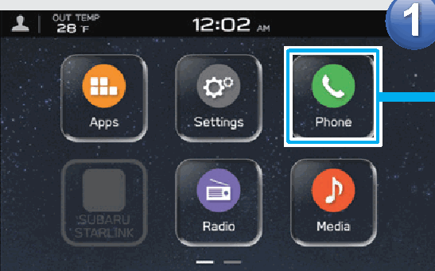
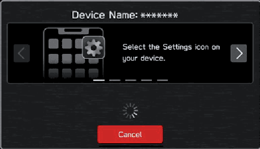

<!-- GENERATED:START function=f7cb3194f8a8 (generated; edits inside this block are overwritten by the next publish — write your own notes outside it) -->
# 4. With A Bluetooth Phone/Device

<b>Function path:</b> Quick Guide / With A Bluetooth Phone/Device <b>Source:</b> printed page 23 <b>Test-ready:</b> no — procedure missing or thresholds unfilled

Every "Presumed requirement" row below is machine-derived from the Owner's Manual text by rule-based extraction — not AI-written — and traceable to the printed page in its Source column.

## Figures (areas of the original PDF; the OM has no figure numbers or captions)

- Figure 4-1 source: p.23
- (Copied from OM) Prepare the Bluetooth

- Figure 4-2 source: p.23
- (Copied from OM) Guide

## 4-2-1. Service overview

| # | Presumed requirement | Strength | Source |
|---|---|---|---|
| 1 | With A Bluetooth Phone/DeviceDisplay the phone screen. | capability | p.23 / text |
| 2 | With A Bluetooth Phone/DevicePrepare the Bluetooth phone/device to be paired. | capability | p.23 / text |
| 3 | With A Bluetooth Phone/DeviceRegister the Bluetooth phone/device. | capability | p.23 / text |
| 4 | With A Bluetooth Phone/DeviceIf a confirmation message appears asking whether to transfer the phone’s contact data to the system, select the appropriate button. | capability | p.23 / text |
| 5 | With A Bluetooth Phone/DeviceOperate the Bluetooth phone/device. | capability | p.23 / text |
| 6 | With A Bluetooth Phone/DeviceFollow instructions displayed to operate the Bluetooth phone/device. | capability | p.23 / text |
| 7 | With A Bluetooth Phone/DeviceIf unable to pair, check whether your Bluetooth phone/device is compatible with the system. | capability | p.23 / text |
<!-- GENERATED:END function=f7cb3194f8a8 -->

