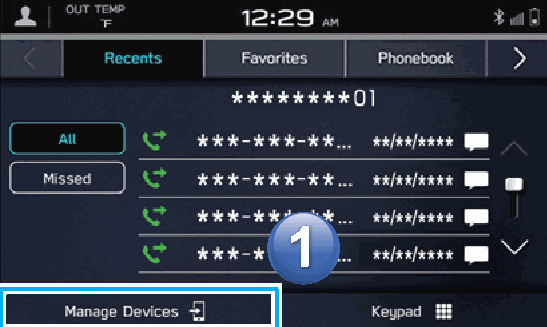
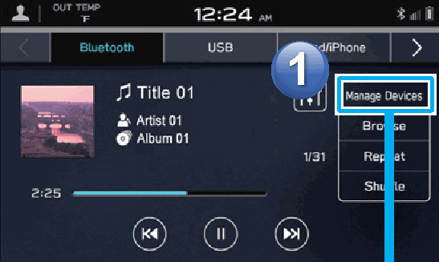
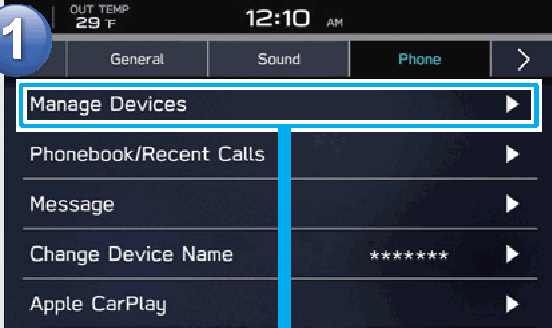
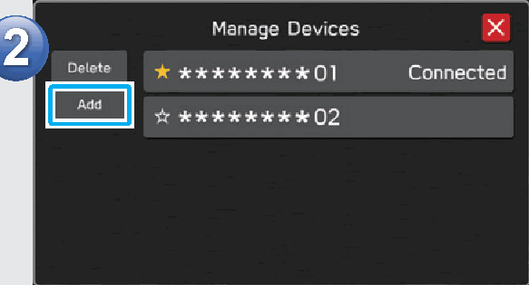

<!-- GENERATED:START function=ced471fbdeea (generated; edits inside this block are overwritten by the next publish — write your own notes outside it) -->
# 5. Adding A Bluetooth Phone/Device

<b>Function path:</b> Quick Guide / Adding A Bluetooth Phone/Device <b>Source:</b> printed page 24 <b>Test-ready:</b> no — procedure missing or thresholds unfilled

Every "Presumed requirement" row below is machine-derived from the Owner's Manual text by rule-based extraction — not AI-written — and traceable to the printed page in its Source column.

## Figures (areas of the original PDF; the OM has no figure numbers or captions)

- Figure 5-1 source: p.24
- (Copied from OM) phone screen

- Figure 5-2 source: p.24
- (Copied from OM) Bluetooth audio screen

- Figure 5-3 source: p.24
- (Copied from OM) settings screen

- Figure 5-4 source: p.24
- (Copied from OM) Bluetooth audio screen

## 5-2-1. Service overview

| # | Presumed requirement | Strength | Source |
|---|---|---|---|
| 1 | Adding A Bluetooth Phone/DeviceAdding from the phone screen. | capability | p.24 / text |
| 2 | Adding A Bluetooth Phone/DeviceAdding from the Adding from the Bluetooth audio screen settings screen. | capability | p.24 / text |
<!-- GENERATED:END function=ced471fbdeea -->

