<!-- GENERATED:START function=72e3a88ac6d6 (generated; edits inside this block are overwritten by the next publish — write your own notes outside it) -->
# 7. Phone Screen

<b>Function path:</b> Quick Guide / Phone Screen <b>Source:</b> printed page 26, 27, 28 <b>Test-ready:</b> no — procedure missing or thresholds unfilled

Every "Presumed requirement" row below is machine-derived from the Owner's Manual text by rule-based extraction — not AI-written — and traceable to the printed page in its Source column.

## Figures (areas of the original PDF; the OM has no figure numbers or captions)
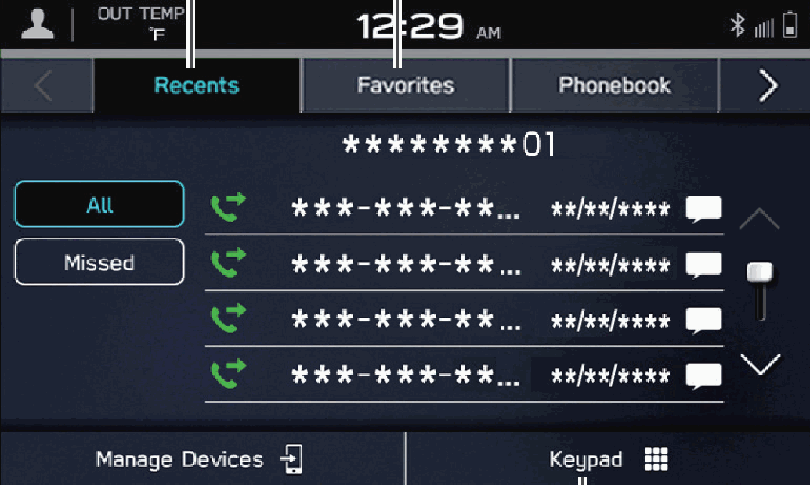
- Figure 7-1 source: p.26
- (Copied from OM) Directly input a number
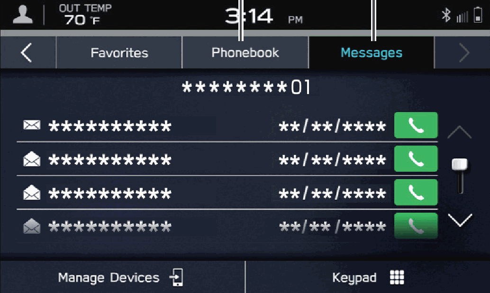
- Figure 7-2 source: p.26
- (Copied from OM) P.121,122,123
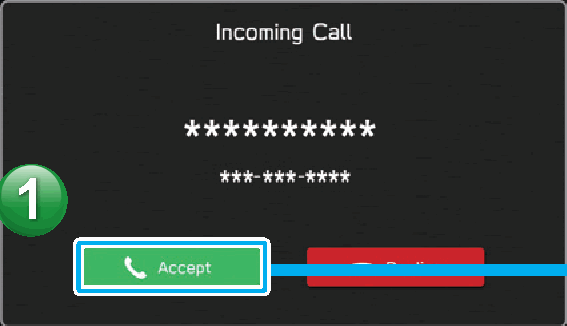
- Figure 7-3 source: p.27
- (Copied from OM) Mute the connected
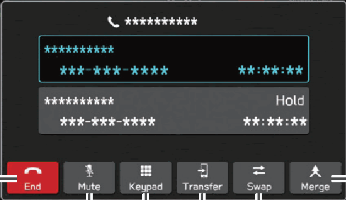
- Figure 7-4 source: p.27
- (Copied from OM) Start three-way
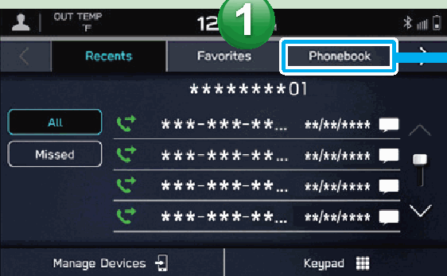
- Figure 7-5 source: p.27
- (Copied from OM) The notification setting on the Bluetooth phone may need to be
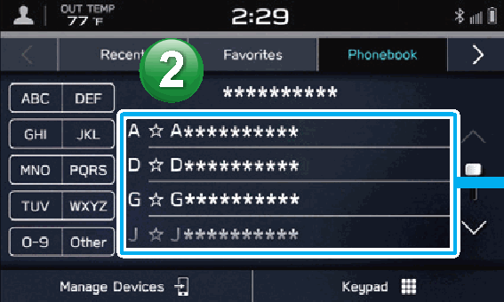
- Figure 7-6 source: p.27
- (Copied from OM) not be possible depending on the Bluetooth phone used.
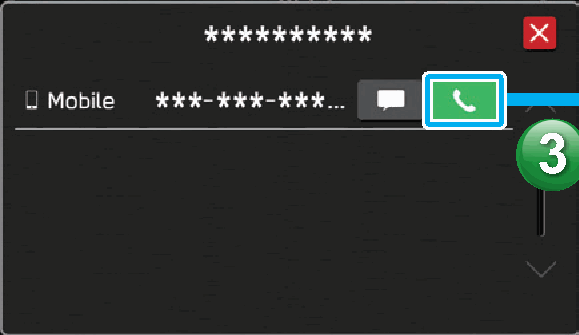
- Figure 7-7 source: p.27
- (Copied from OM) Select number for making call.
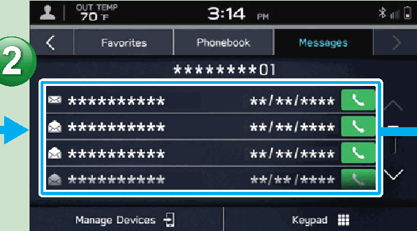
- Figure 7-8 source: p.28
- (Copied from OM) Having messages
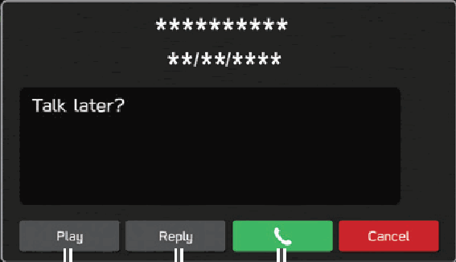
- Figure 7-9 source: p.28
- (Copied from OM) Calling the message

- Figure 7-10 source: p.28
- (Copied from OM) number.

- Figure 7-11 source: p.28
- (Copied from OM) The notification setting on the Bluetooth phone may need to be
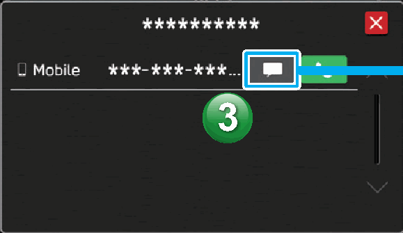
- Figure 7-12 source: p.28
- (Copied from OM) number.
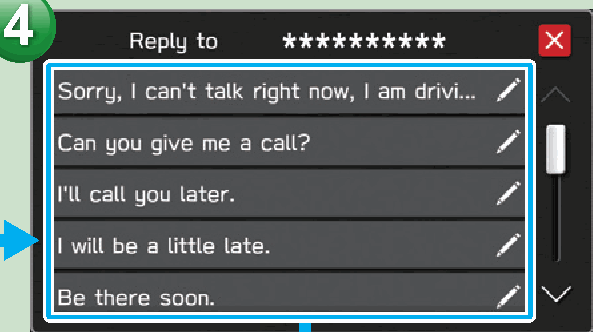
- Figure 7-13 source: p.28
- (Copied from OM) Select message.

## 7-2-1. Service overview

| # | Presumed requirement | Strength | Source |
|---|---|---|---|
| 1 | Phone ScreenCall or send a text message* to a recent contact P.112,122. | capability | p.26 / text |
| 2 | Phone ScreenCall or send a text message* to a registered favorite P.113,122. | capability | p.26 / text |
| 3 | Phone ScreenDirectly input a number to place a call P.114. | capability | p.26 / text |
| 4 | Phone ScreenCall or send a text message* to a contact in the phonebook on the Bluetooth connected phone P.114,122 Check or reply* to messages/place calls from received message list P.121,122,123. | capability | p.26 / text |
| 5 | Phone Screen*: If available (for iOS only reception possible). | constraint | p.26 / text |
| 6 | Phone ScreenIncoming call screen is displayed. | capability | p.27 / text |
| 7 | Phone Screen- Operation Flow: Placing Calls from the Phonebook -. | capability | p.27 / text |
| 8 | Phone ScreenSelect call recipient from phonebook. | capability | p.27 / text |
| 9 | Phone ScreenThe notification setting on the Bluetooth phone may need to be activated in order to download the phonebook. If the phonebook download setting is off and a phonebook has not been downloaded, a message will be displayed and the phonebook of the connected Bluetooth phone can be downloaded. P.91. | constraint | p.27 / text |
| 10 | Phone ScreenIn-call screen is displayed. | capability | p.27 / text |
| 11 | Phone ScreenStart three-way End call call Mute the connected Switch to call with smartphone’s voice other party Keypad Transfer call to Bluetooth phone In-call screen display and operation may differ, or may not be possible depending on the Bluetooth phone used. | capability | p.27 / text |
| 12 | Phone ScreenSelect number for making call. | capability | p.27 / text |
| 13 | Phone ScreenPlace call. | capability | p.27 / text |
| 14 | Phone ScreenIncoming text screen is displayed. | capability | p.28 / text |
| 15 | Phone ScreenWhen there are unread messages in the message inbox. | capability | p.28 / text |
| 16 | Phone Screen- Operation Flow: Sending a Message* from the Phonebook -. | capability | p.28 / text |
| 17 | Phone ScreenSelect a contact from phonebook. | capability | p.28 / text |
| 18 | Phone ScreenThe notification setting on the Bluetooth phone may need to be activated in order to download the phonebook. If the phonebook download setting is off and a phonebook has not been downloaded, a message will be displayed and the phonebook of the connected Bluetooth phone can be downloaded. P.91. | constraint | p.28 / text |
| 19 | Phone ScreenMessage screen is displayed. | capability | p.28 / text |
| 20 | Phone ScreenHaving messages Calling the message read out sender Replying to a message. | capability | p.28 / text |
| 21 | Phone ScreenSelect the message Select message. icon next to the desired number. | capability | p.28 / text |
| 22 | Phone ScreenSend message. | capability | p.28 / text |
<!-- GENERATED:END function=72e3a88ac6d6 -->

