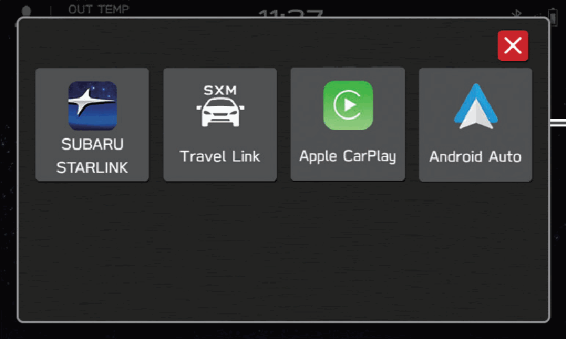
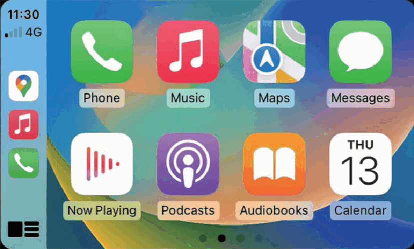
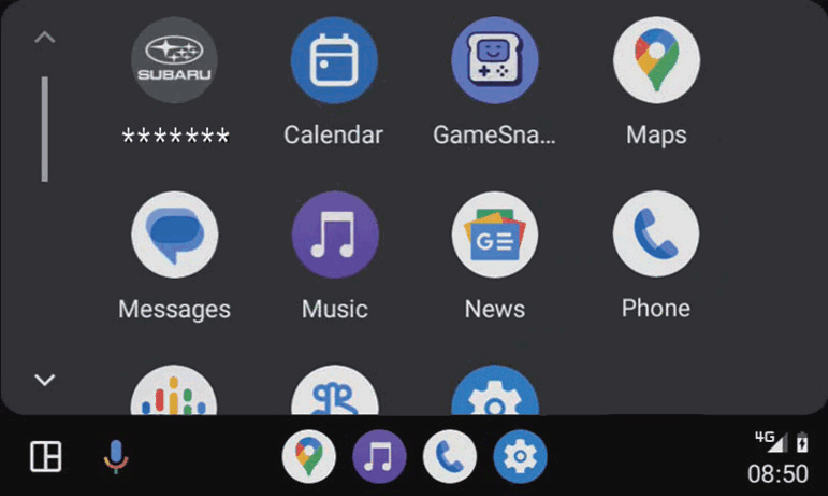
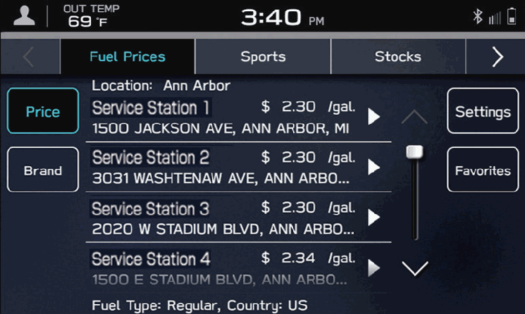
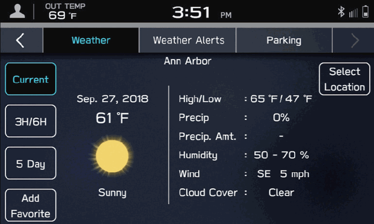
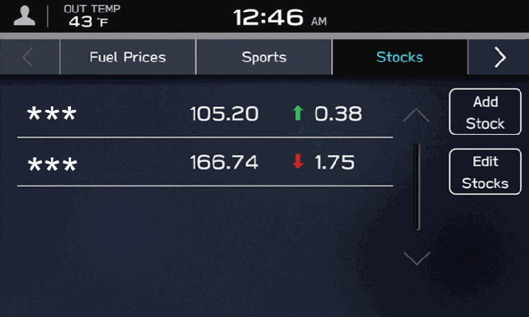
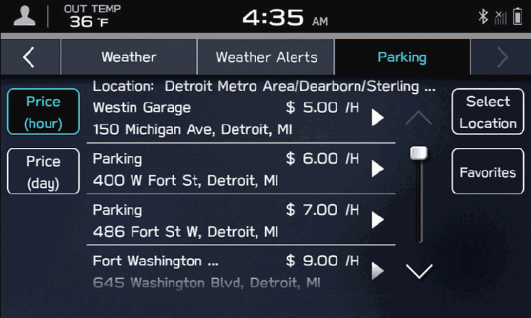
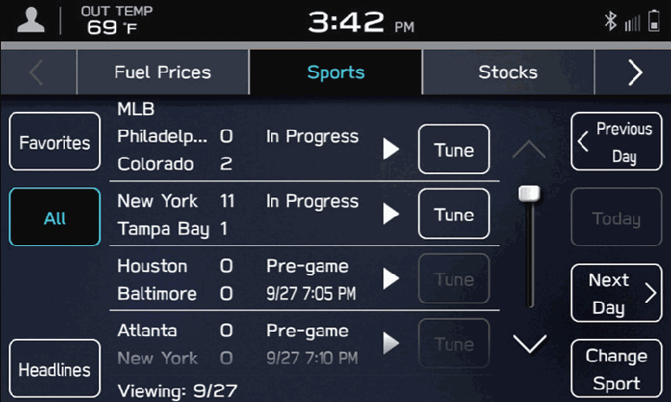
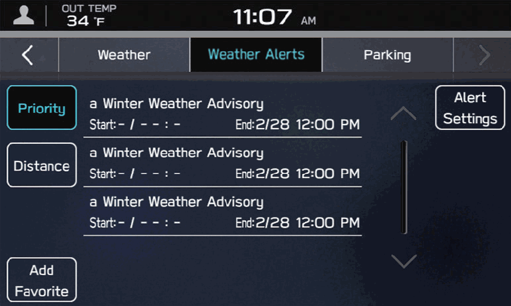

<!-- GENERATED:START function=ff44f90fa2b7 (generated; edits inside this block are overwritten by the next publish — write your own notes outside it) -->
# 8. Apps Screen

<b>Function path:</b> Quick Guide / Apps Screen <b>Source:</b> printed page 29, 30, 31 <b>Test-ready:</b> no — procedure missing or thresholds unfilled

Every "Presumed requirement" row below is machine-derived from the Owner's Manual text by rule-based extraction — not AI-written — and traceable to the printed page in its Source column.

## Figures (areas of the original PDF; the OM has no figure numbers or captions)

- Figure 8-1 source: p.29
- (Copied from OM) applications

- Figure 8-2 source: p.29
- (Copied from OM) Apple CarPlay can be used to view Apple Maps, play music, and place calls by

- Figure 8-3 source: p.30
- (Copied from OM) Android Auto can be used to view Google Maps, play music, and place calls by

- Figure 8-4 source: p.31
- (Copied from OM) Fuel prices

- Figure 8-5 source: p.31
- (Copied from OM) Weather

- Figure 8-6 source: p.31
- (Copied from OM) Stocks

- Figure 8-7 source: p.31
- (Copied from OM) Parking

- Figure 8-8 source: p.31
- (Copied from OM) Sports

- Figure 8-9 source: p.31
- (Copied from OM) Weather alerts

## 8-2-1. Service overview

| # | Presumed requirement | Strength | Source |
|---|---|---|---|
| 1 | Apps ScreenApple CarPlay. | capability | p.29 / text |
| 2 | Apps ScreenUsable applications. | capability | p.29 / text |
| 3 | Apps ScreenApple CarPlay can be used to view Apple Maps, play music, and place calls by connecting an Apple CarPlay device to the system. Supported applications can also be run. | capability | p.29 / text |
| 4 | Apps ScreenTo use the Apple CarPlay application, connect an Apple CarPlay device to the USB port with undamaged genuine USB cable. P.129. | capability | p.29 / text |
| 5 | Apps ScreenFor details on the services or the operations, check the Apple CarPlay site (https://www.apple.com/ios/carplay/). | capability | p.29 / text |
| 6 | Apps ScreenAndroid Auto. | capability | p.30 / text |
| 7 | Apps ScreenAndroid Auto can be used to view Google Maps, play music, and place calls by connecting an Android Auto device to the system, using USB cable and Bluetooth. Supported applications can also be run. | capability | p.30 / text |
| 8 | Apps ScreenTo use the Android Auto application, connect your Android Auto device to the USB port with undamaged genuine USB cable. P.133. | capability | p.30 / text |
| 9 | Apps ScreenFor details on the services or the operations, check the Android Auto site (https://www.android.com/auto/) and (https://support.google.com/androidauto/). | capability | p.30 / text |
| 10 | Apps ScreenSiriusXM Travel Link is a service provided by SiriusXM® Radio, and can be used to view information on fuel prices, sports, stocks, weather, weather alerts and parking. P.137 To receive the data service information in the vehicle, a subscription to the SiriusXM® Radio Service is necessary following a free trial. P.161. | capability | p.31 / text |
| 11 | Apps ScreenFuel prices Sports. | capability | p.31 / text |
| 12 | Apps ScreenWeather Weather alerts. | capability | p.31 / text |
<!-- GENERATED:END function=ff44f90fa2b7 -->

