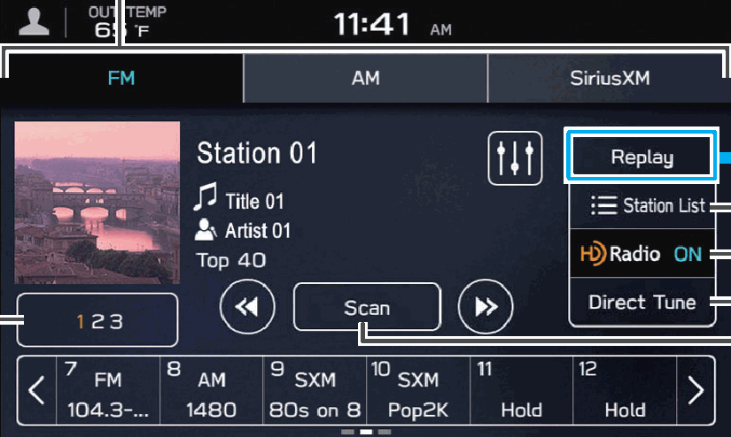
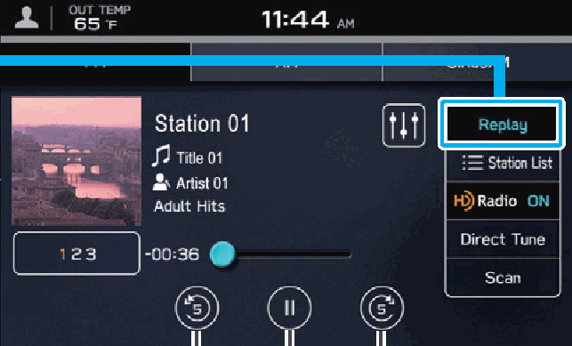
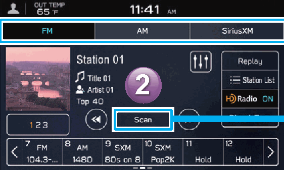

<!-- GENERATED:START function=1d8a44cc6cec (generated; edits inside this block are overwritten by the next publish — write your own notes outside it) -->
# 9. Radio Screen

<b>Function path:</b> Quick Guide / Radio Screen <b>Source:</b> printed page 32, 33 <b>Test-ready:</b> no — procedure missing or thresholds unfilled

Every "Presumed requirement" row below is machine-derived from the Owner's Manual text by rule-based extraction — not AI-written — and traceable to the printed page in its Source column.

## Figures (areas of the original PDF; the OM has no figure numbers or captions)

- Figure 9-1 source: p.32
- (Copied from OM) Preset stations/channels

- Figure 9-2 source: p.32
- (Copied from OM) Skip backward

- Figure 9-3 source: p.33
- (Copied from OM) radio station.

## 9-2-1. Service overview

| # | Presumed requirement | Strength | Source |
|---|---|---|---|
| 1 | Radio ScreenChange radio mode. | capability | p.32 / text |
| 2 | Radio ScreenPreset stations/channels. | capability | p.32 / text |
| 3 | Radio ScreenSelect to change multicast channels available (FM). | capability | p.32 / text |
| 4 | Radio ScreenSkip backward Skip forward Pause/play Select to display a list of receivable stations Depending on the radio (AM/FM). broadcast, the broadcast can be temporarily saved and Select to turn HD Radio played back later. P.157 mode on/off (AM/FM). | capability | p.32 / text |
| 5 | Radio ScreenSelect to search for stations/channels by entering frequency/ channel number. | capability | p.32 / text |
| 6 | Radio ScreenSelect to scan for receivable stations/channels. | capability | p.32 / text |
| 7 | Radio ScreenSelect the radio band and the radio station. | capability | p.33 / text |
| 8 | Radio ScreenA valid subscription to SiriusXM® Radio is required to receive satellite radio service. | capability | p.33 / text |
<!-- GENERATED:END function=1d8a44cc6cec -->

