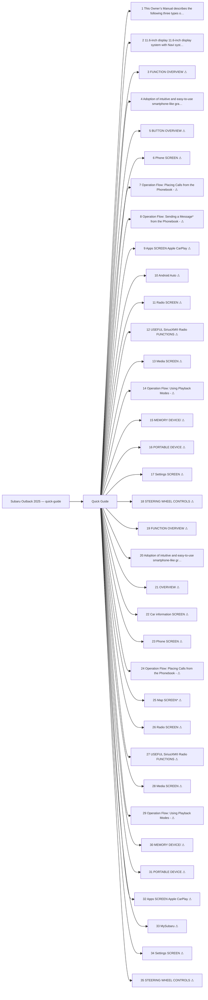

<!-- GENERATED:START index (generated; edits inside this block are overwritten by the next publish — write your own notes outside it) -->
# Subaru Outback 2025 — quick-guide — Presumed specification

> This is a machine-derived estimate, not an official requirements document. Numeric thresholds left blank could not be found in the manual and must be filled in by a tester with evidence.

| Field | Value |
|---|---|
| Maker / Model | Subaru / Outback 2025 |
| Scope | quick-guide |
| Markets | US, CA |
| Profile | subaru_chapter_toc_v1 |
| Manual ID | subaru/outback-2025/ivi |

## Numeric thresholds

- Thresholds detected: **2**
- Filled: **2** / unfilled: **0**
- Test-ready functions: **0 / 35**

The manual states almost no numbers, so a tester fills the thresholds in. A function that still has an unfilled threshold cannot become a test specification (`is_test_ready=false`). Fill them in `overlay/thresholds.yaml` or on the screen.

## Figures in the manual

- Figures: **168** / images rendered: **168**

Each image is a rendering of the corresponding area of the original PDF. **Images are not kept in the repository** (they are copies of another company's manual); `publish` creates them under `../figures/` on the machine that runs it.

## Glossary (registered by a reviewer)

How wording in the manual maps to the in-house term. **The original text is not rewritten** — the mapping is only annotated here. Register terms on the Glossary screen. Evidence (why the mapping holds) is required.

| In-house term | Category | Wording in the manual | Hits | Evidence |
|---|---|---|---:|---|
| AA | abbreviation | `Android Auto` | 26 | Counted by string match over workspace/subaru/**/published/*.md (2026-09-01): outback-2026 31 / outback-2025 24 / ascent-2026 1. Always printed in full ("Android Auto") — no abbreviated form appears in the manual text; "AA" is an in-house-only abbreviation. |

## Functions

| No. | Function | Area | Requirements | Figures | Unfilled thresholds | Test-ready |
|---|---|---|---|---|---|---|
| 1 | [This Owner’s Manual describes the following three types of system. Dual 7.0-inch display system Two 7.0-inch touch screen Display audio system](/specifications/subaru/outback-2025/ivi/file/1-this-owners-manual-describes-the-following-three-types-of-system-dual-7-0-inch-d.md?chapter=quick-guide) | Quick Guide | 2 | 1 | 0 | - |
| 2 | [11.6-inch display 11.6-inch display system with Navi system 11.6-inch touch screen 11.6-inch touch screen Display audio system Display audio with Navigation system](/specifications/subaru/outback-2025/ivi/file/2-11-6-inch-display-11-6-inch-display-system-with-navi-system-11-6-inch-touch-scre.md?chapter=quick-guide) | Quick Guide | 3 | 2 | 0 | - |
| 3 | [FUNCTION OVERVIEW](/specifications/subaru/outback-2025/ivi/file/3-function-overview.md?chapter=quick-guide) | Quick Guide | 20 | 2 | 0 | - |
| 4 | [Adoption of intuitive and easy-to-use smartphone-like graphical user interface](/specifications/subaru/outback-2025/ivi/file/4-adoption-of-intuitive-and-easy-to-use-smartphone-like-graphical-user-interface.md?chapter=quick-guide) | Quick Guide | 14 | 5 | 0 | - |
| 5 | [BUTTON OVERVIEW](/specifications/subaru/outback-2025/ivi/file/5-button-overview.md?chapter=quick-guide) | Quick Guide | 40 | 23 | 0 | - |
| 6 | [Phone SCREEN](/specifications/subaru/outback-2025/ivi/file/6-phone-screen.md?chapter=quick-guide) | Quick Guide | 6 | 3 | 0 | - |
| 7 | [Operation Flow: Placing Calls from the Phonebook -](/specifications/subaru/outback-2025/ivi/file/7-operation-flow-placing-calls-from-the-phonebook.md?chapter=quick-guide) | Quick Guide | 8 | 5 | 0 | - |
| 8 | [Operation Flow: Sending a Message* from the Phonebook -](/specifications/subaru/outback-2025/ivi/file/8-operation-flow-sending-a-message-from-the-phonebook.md?chapter=quick-guide) | Quick Guide | 6 | 5 | 0 | - |
| 9 | [Apps SCREEN Apple CarPlay](/specifications/subaru/outback-2025/ivi/file/9-apps-screen-apple-carplay.md?chapter=quick-guide) | Quick Guide | 5 | 2 | 0 | - |
| 10 | [Android Auto](/specifications/subaru/outback-2025/ivi/file/10-android-auto.md?chapter=quick-guide) | Quick Guide | 6 | 7 | 0 | - |
| 11 | [Radio SCREEN](/specifications/subaru/outback-2025/ivi/file/11-radio-screen.md?chapter=quick-guide) | Quick Guide | 8 | 3 | 0 | - |
| 12 | [USEFUL SiriusXM® Radio FUNCTIONS](/specifications/subaru/outback-2025/ivi/file/12-useful-siriusxm-radio-functions.md?chapter=quick-guide) | Quick Guide | 6 | 1 | 0 | - |
| 13 | [Media SCREEN](/specifications/subaru/outback-2025/ivi/file/13-media-screen.md?chapter=quick-guide) | Quick Guide | 6 | 1 | 0 | - |
| 14 | [Operation Flow: Using Playback Modes -](/specifications/subaru/outback-2025/ivi/file/14-operation-flow-using-playback-modes.md?chapter=quick-guide) | Quick Guide | 1 | 2 | 0 | - |
| 15 | [MEMORY DEVICE/](/specifications/subaru/outback-2025/ivi/file/15-memory-device.md?chapter=quick-guide) | Quick Guide | 1 | 0 | 0 | - |
| 16 | [PORTABLE DEVICE](/specifications/subaru/outback-2025/ivi/file/16-portable-device.md?chapter=quick-guide) | Quick Guide | 3 | 2 | 0 | - |
| 17 | [Settings SCREEN](/specifications/subaru/outback-2025/ivi/file/17-settings-screen.md?chapter=quick-guide) | Quick Guide | 6 | 9 | 0 | - |
| 18 | [STEERING WHEEL CONTROLS](/specifications/subaru/outback-2025/ivi/file/18-steering-wheel-controls.md?chapter=quick-guide) | Quick Guide | 6 | 0 | 0 | - |
| 19 | [FUNCTION OVERVIEW](/specifications/subaru/outback-2025/ivi/file/19-function-overview.md?chapter=quick-guide) | Quick Guide | 22 | 3 | 0 | - |
| 20 | [Adoption of intuitive and easy-to-use smartphone-like graphical user interface](/specifications/subaru/outback-2025/ivi/file/20-adoption-of-intuitive-and-easy-to-use-smartphone-like-graphical-user-interface.md?chapter=quick-guide) | Quick Guide | 14 | 8 | 0 | - |
| 21 | [OVERVIEW](/specifications/subaru/outback-2025/ivi/file/21-overview.md?chapter=quick-guide) | Quick Guide | 38 | 25 | 0 | - |
| 22 | [Car information SCREEN](/specifications/subaru/outback-2025/ivi/file/22-car-information-screen.md?chapter=quick-guide) | Quick Guide | 2 | 2 | 0 | - |
| 23 | [Phone SCREEN](/specifications/subaru/outback-2025/ivi/file/23-phone-screen.md?chapter=quick-guide) | Quick Guide | 6 | 3 | 0 | - |
| 24 | [Operation Flow: Placing Calls from the Phonebook -](/specifications/subaru/outback-2025/ivi/file/24-operation-flow-placing-calls-from-the-phonebook.md?chapter=quick-guide) | Quick Guide | 18 | 11 | 0 | - |
| 25 | [Map SCREEN*](/specifications/subaru/outback-2025/ivi/file/25-map-screen.md?chapter=quick-guide) | Quick Guide | 20 | 13 | 0 | - |
| 26 | [Radio SCREEN](/specifications/subaru/outback-2025/ivi/file/26-radio-screen.md?chapter=quick-guide) | Quick Guide | 9 | 3 | 0 | - |
| 27 | [USEFUL SiriusXM® Radio FUNCTIONS](/specifications/subaru/outback-2025/ivi/file/27-useful-siriusxm-radio-functions.md?chapter=quick-guide) | Quick Guide | 8 | 1 | 0 | - |
| 28 | [Media SCREEN](/specifications/subaru/outback-2025/ivi/file/28-media-screen.md?chapter=quick-guide) | Quick Guide | 8 | 1 | 0 | - |
| 29 | [Operation Flow: Using Playback Modes -](/specifications/subaru/outback-2025/ivi/file/29-operation-flow-using-playback-modes.md?chapter=quick-guide) | Quick Guide | 1 | 2 | 0 | - |
| 30 | [MEMORY DEVICE/](/specifications/subaru/outback-2025/ivi/file/30-memory-device.md?chapter=quick-guide) | Quick Guide | 1 | 0 | 0 | - |
| 31 | [PORTABLE DEVICE](/specifications/subaru/outback-2025/ivi/file/31-portable-device.md?chapter=quick-guide) | Quick Guide | 3 | 2 | 0 | - |
| 32 | [Apps SCREEN Apple CarPlay](/specifications/subaru/outback-2025/ivi/file/32-apps-screen-apple-carplay.md?chapter=quick-guide) | Quick Guide | 5 | 3 | 0 | - |
| 33 | [MySubaru](/specifications/subaru/outback-2025/ivi/file/33-mysubaru.md?chapter=quick-guide) | Quick Guide | 8 | 7 | 0 | - |
| 34 | [Settings SCREEN](/specifications/subaru/outback-2025/ivi/file/34-settings-screen.md?chapter=quick-guide) | Quick Guide | 7 | 11 | 0 | - |
| 35 | [STEERING WHEEL CONTROLS](/specifications/subaru/outback-2025/ivi/file/35-steering-wheel-controls.md?chapter=quick-guide) | Quick Guide | 4 | 0 | 0 | - |
<!-- GENERATED:END index -->

