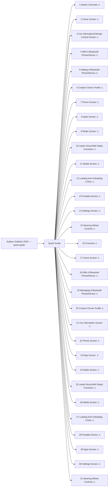

<!-- GENERATED:START index (generated; edits inside this block are overwritten by the next publish — write your own notes outside it) -->
# Subaru Outback 2025 — quick-guide — Presumed specification

> This is a machine-derived estimate, not an official requirements document. Numeric thresholds left blank could not be found in the manual and must be filled in by a tester with evidence.

| Field | Value |
|---|---|
| Maker / Model | Subaru / Outback 2025 |
| Scope | quick-guide |
| Markets | US, CA |
| Profile | subaru_chapter_toc_v1 |
| Manual ID | subaru/outback-2025/ivi |

## Numeric thresholds
Filled: 0 / Unfilled: 0

```mermaid
pie showData
    "Filled" : 0
    "Unfilled" : 0
```

## Figures in the manual
159 figure area(s) detected.

## Headings not matched to body text
These bookmark entries could not be located in the extracted body text and were not turned into functions. Reported instead of silently dropped.
- Home Screen
- Car Information/Climate Control Screen
- With A Bluetooth Phone/Device
- Adding A Bluetooth Phone/Device
- Create A Driver Profile
- Loading And Unloading A Disc
- Home Screen
- With A Bluetooth Phone/Device
- Managing A Bluetooth Phone/Device
- Create A Driver Profile
- Loading And Unloading A Disc

## Functions



| No. | Function | Area | Requirements | Figures | Unfilled thresholds | Test-ready |
|---|---|---|---|---|---|---|
| 1 | Button Overview | Quick Guide | 8 | 0 | 0 | - |
| 2 | Home Screen | Quick Guide | 10 | 8 | 0 | - |
| 3 | Car Information/Climate Control Screen | Quick Guide | 8 | 2 | 0 | - |
| 4 | With A Bluetooth Phone/Device | Quick Guide | 7 | 2 | 0 | - |
| 5 | Adding A Bluetooth Phone/Device | Quick Guide | 2 | 4 | 0 | - |
| 6 | Create A Driver Profile | Quick Guide | 5 | 7 | 0 | - |
| 7 | Phone Screen | Quick Guide | 22 | 13 | 0 | - |
| 8 | Apps Screen | Quick Guide | 12 | 9 | 0 | - |
| 9 | Radio Screen | Quick Guide | 8 | 3 | 0 | - |
| 10 | Useful SiriusXM® Radio Functions | Quick Guide | 6 | 1 | 0 | - |
| 11 | Media Screen | Quick Guide | 4 | 1 | 0 | - |
| 12 | Loading And Unloading A Disc | Quick Guide | 5 | 2 | 0 | - |
| 13 | Portable Device | Quick Guide | 3 | 2 | 0 | - |
| 14 | Settings Screen | Quick Guide | 6 | 9 | 0 | - |
| 15 | Steering Wheel Controls | Quick Guide | 43 | 12 | 0 | - |
| 16 | Overview | Quick Guide | 11 | 1 | 0 | - |
| 17 | Home Screen | Quick Guide | 14 | 10 | 0 | - |
| 18 | With A Bluetooth Phone/Device | Quick Guide | 5 | 4 | 0 | - |
| 19 | Managing A Bluetooth Phone/Device | Quick Guide | 3 | 3 | 0 | - |
| 20 | Create A Driver Profile | Quick Guide | 5 | 7 | 0 | - |
| 21 | Car Information Screen | Quick Guide | 2 | 2 | 0 | - |
| 22 | Phone Screen | Quick Guide | 25 | 14 | 0 | - |
| 23 | Map Screen žžžžžžžžžžžžžžžžžžžžžžžžžžžžžžžžžžžžžžžžž | Quick Guide | 20 | 13 | 0 | - |
| 24 | Radio Screen | Quick Guide | 9 | 3 | 0 | - |
| 25 | Useful SiriusXM® Radio Functions | Quick Guide | 8 | 1 | 0 | - |
| 26 | Media Screen | Quick Guide | 6 | 1 | 0 | - |
| 27 | Loading And Unloading A Disc | Quick Guide | 5 | 2 | 0 | - |
| 28 | Portable Device | Quick Guide | 3 | 2 | 0 | - |
| 29 | Apps Screen | Quick Guide | 14 | 10 | 0 | - |
| 30 | Settings Screen | Quick Guide | 7 | 11 | 0 | - |
| 31 | Steering Wheel Controls | Quick Guide | 4 | 0 | 0 | - |
<!-- GENERATED:END index -->

