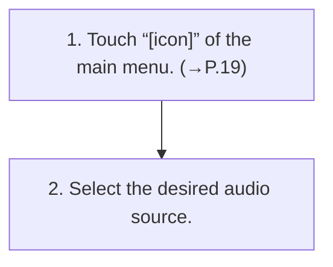

<!-- GENERATED:START function=6a194ed9769e (generated; edits inside this block are overwritten by the next publish — write your own notes outside it) -->
# 1. Selecting an audio source

<b>Function path:</b> Audio / Selecting an audio source <b>Source:</b> printed page 90 <b>Test-ready:</b> yes — no unfilled thresholds and a procedure is present

## Procedure

| Seq | Step | Operation (Copied from OM) | Source |
|---|---|---|---|
| 1 | 1 | Touch “[icon]” of the main menu. (→P.19) | p.90 / step |
| 2 | 2 | Select the desired audio source. | p.90 / step |

<!-- GENERATED:END function=6a194ed9769e -->

