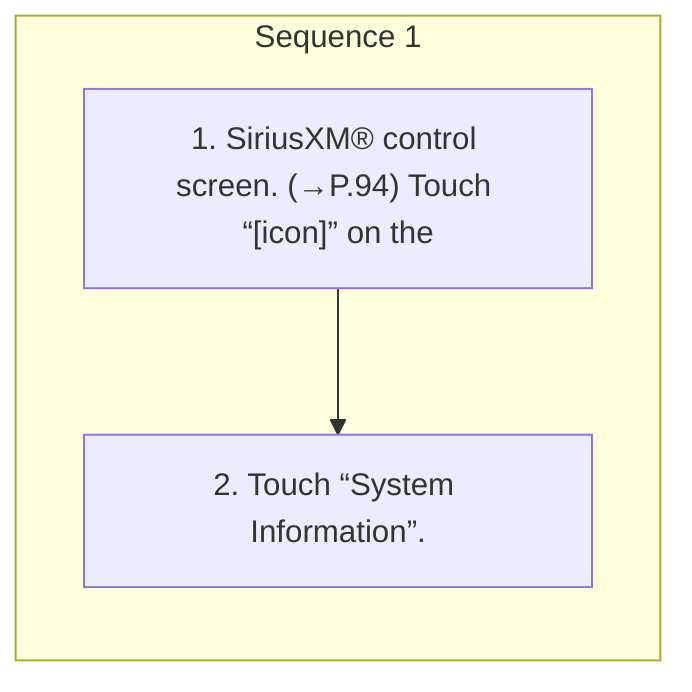

<!-- GENERATED:START function=9b967ec8460d (generated; edits inside this block are overwritten by the next publish — write your own notes outside it) -->
# 10. Displaying the radio ID

<b>Function path:</b> Audio / Displaying the radio ID <b>Source:</b> printed page 98 <b>Test-ready:</b> yes — no unfilled thresholds and a procedure is present

Every "Presumed requirement" row below is machine-derived from the Owner's Manual text by rule-based extraction — not AI-written — and traceable to the printed page in its Source column.

## Procedure

| Seq | Step | Operation (Copied from OM) | Source |
|---|---|---|---|
| 1 | 1 | SiriusXM® control screen. (→P.94) Touch “[icon]” on the | p.98 / step |
| 1 | 2 | Touch “System Information”. | p.98 / step |

## 10-2-1. Service overview

| # | Presumed requirement | Strength | Source |
|---|---|---|---|
| 1 | Displaying the radio IDEach SiriusXM tuner is identified with a unique radio ID. The radio ID is required when activating your SiriusXM or when reporting a problem. | constraint | p.98 / text |

## 10-2-2. Service requirements

| # | Presumed requirement | Strength | Source |
|---|---|---|---|
| 1 | Step -Your radio ID will be displayed. | capability | p.98 / bullet |
<!-- GENERATED:END function=9b967ec8460d -->

