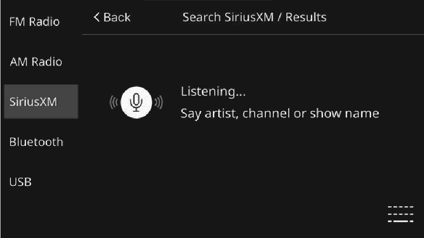
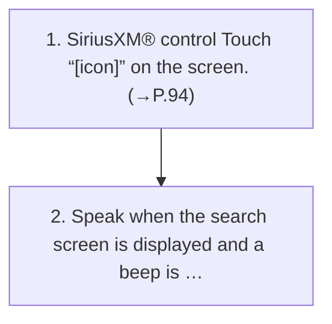

<!-- GENERATED:START function=9f626bfcadf7 (generated; edits inside this block are overwritten by the next publish — write your own notes outside it) -->
# 12. Searching for a current content

<b>Function path:</b> Audio / Searching for a current content <b>Source:</b> printed page 99, 100 <b>Test-ready:</b> yes — no unfilled thresholds and a procedure is present

Every "Presumed requirement" row below is machine-derived from the Owner's Manual text by rule-based extraction — not AI-written — and traceable to the printed page in its Source column.

## Figures (areas of the original PDF; the OM has no figure numbers or captions)

- Figure 12-1 source: p.100
- (Copied from OM) phone icon or text message.

## Procedure

| Seq | Step | Operation (Copied from OM) | Source |
|---|---|---|---|
| 1 | 1 | SiriusXM® control Touch “[icon]” on the screen. (→P.94) | p.100 / step |
| 2 | 2 | Speak when the search screen is displayed and a beep is heard. | p.100 / step |

## 12-2-1. Service overview

| # | Presumed requirement | Strength | Source |
|---|---|---|---|
| 1 | Searching for a current contentA currently aired program can be searched for by keyword(s), such as channel number, category, team name, etc., using either voice recognition or on screen. To enable search, display the search screen. | capability | p.99 / text |
| 2 | Searching for a current contentSelect the desired content from the search results list displayed. | capability | p.99 / text |
| 3 | Searching for a current contentMicrophone. | capability | p.99 / text |

## 12-2-2. Service requirements

| # | Presumed requirement | Strength | Source |
|---|---|---|---|
| 1 | Step -User’s speech is recognized by a built-in microphone. | capability | p.99 / bullet |
| 2 | Step -Wait for the confirmation beep before speaking a command. | capability | p.100 / bullet |
| 3 | Step -Spoken too quickly. | capability | p.100 / bullet |
| 4 | Step -Spoken at a low or high volume. | capability | p.100 / bullet |
| 5 | Step -Driving with a window open. | capability | p.100 / bullet |
| 6 | Step -The air conditioning speed is set high. | capability | p.100 / bullet |
| 7 | Step -The current position is outside the communication area. | capability | p.100 / bullet |
| 8 | Step -When air from the ventilator blows directly toward the microphone. | capability | p.100 / bullet |
| 9 | Searching for a current contentSearching for the desired content. | capability | p.100 / text |
| 10 | Step -Displays the status of voice recognition, searching, etc. with a microphone icon or text message. | capability | p.100 / bullet |
| 11 | Step -“[icon]”: Select to display keyboard to enter text for search. | capability | p.100 / bullet |
| 12 | Step -Select the microphone icon to refresh speech recognition. | capability | p.100 / bullet |

## 12-3. Requirements for HMI

| # | Presumed requirement | Strength | Source |
|---|---|---|---|
| 1 | Step -Passengers are talking while voice commands are spoken. | capability | p.100 / bullet |

## 12-5. Exception operation

| # | Presumed requirement | Strength | Source |
|---|---|---|---|
| 1 | Step -Voice commands may not be recognized if:. | capability | p.100 / bullet |
| 2 | Step -If there is excessive background noise, such as wind noise, the system may not recognize the command properly and using voice commands may not be possible. | capability | p.100 / bullet |
<!-- GENERATED:END function=9f626bfcadf7 -->

