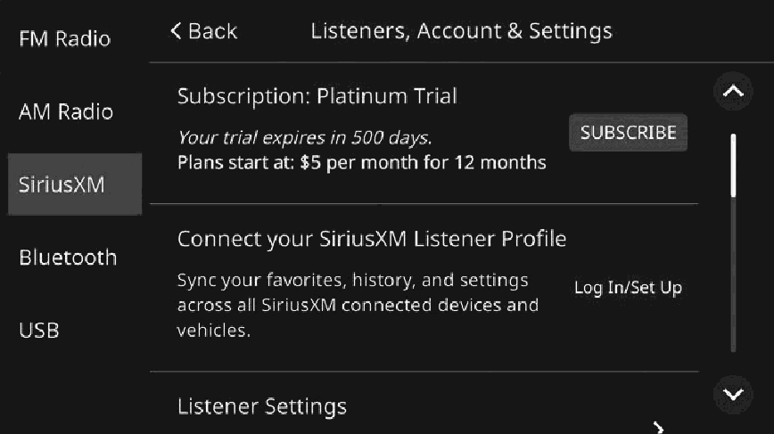
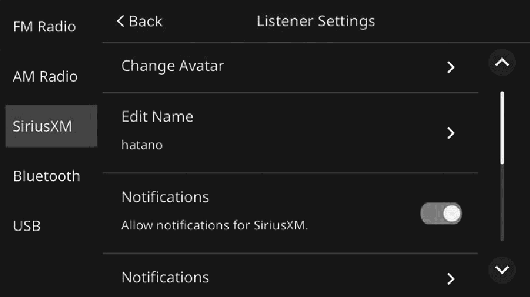
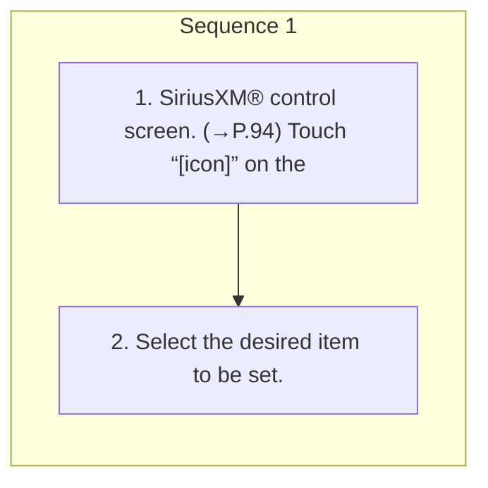

<!-- GENERATED:START function=0b1461817628 (generated; edits inside this block are overwritten by the next publish — write your own notes outside it) -->
# 13. Setting the SiriusXM®

<b>Function path:</b> Audio / Setting the SiriusXM® <b>Source:</b> printed page 100, 101, 102 <b>Test-ready:</b> yes — no unfilled thresholds and a procedure is present

Every "Presumed requirement" row below is machine-derived from the Owner's Manual text by rule-based extraction — not AI-written — and traceable to the printed page in its Source column.

## Figures (areas of the original PDF; the OM has no figure numbers or captions)

- Figure 13-1 source: p.101
- (Copied from OM) 2. Select the desired item to be set.

- Figure 13-2 source: p.102
- (Copied from OM) Select to change avatars.

## Procedure

| Seq | Step | Operation (Copied from OM) | Source |
|---|---|---|---|
| 1 | 1 | SiriusXM® control screen. (→P.94) Touch “[icon]” on the | p.100 / step |
| 1 | 2 | Select the desired item to be set. | p.101 / step |

## 13-2-2. Service requirements

| # | Presumed requirement | Strength | Source |
|---|---|---|---|
| 1 | Step -“SUBSCRIBE”: Select to subscribe to the SiriusXM®. Select the desired method displayed on the screen to proceed to “Subscription” the subscription procedure. | capability | p.101 / bullet |
| 2 | Step -“Manage Account”: Select to manage/switch SiriusXM® accounts. | capability | p.101 / bullet |
| 3 | Step -When logged-in: Displays the profile information of the logged-in user. “Connect your SiriusXM Select to add a profile of a new user. Listener Profile”. | capability | p.101 / bullet |
| 4 | Step -When not logged-in: “Log In/Set Up”: To log in, touch “Log In”. To make a new profile, touch “Get Started”. | capability | p.101 / bullet |
| 5 | Setting the SiriusXM®“Listener Settings” Select to set the listener settings. (→P.102) 5 Select to display notification(s) received while listening to an audio “Notifications Inbox” source other than the SiriusXM®. Touch “Listen Now” to listen to content(s) already notified of. | capability | p.101 / text |
| 6 | Setting the SiriusXM®“System Information” Select to display the system information, such as the radio ID etc. | capability | p.101 / text |
| 7 | Setting the SiriusXM®Select to display the phone number of SiriusXM® customer care and your radio ID. “Help &amp; Support” “Call SiriusXM”: Select to make a call when a Bluetooth compatible phone is connected. | constraint | p.101 / text |
| 8 | Setting the SiriusXM®Select to display announcement regarding the customer agreement, “SiriusXM Legal” privacy policy and other disclosures. | capability | p.101 / text |
| 9 | Setting the SiriusXM®“Your Privacy Choices” Select to display announcement regarding personal information. | capability | p.101 / text |
| 10 | Setting the SiriusXM®“Get the App”: Select to obtain a link to download the SiriusXM® “Get Streaming” application. | capability | p.101 / text |
| 11 | Setting the SiriusXM®Listener settings screen. | capability | p.102 / text |
| 12 | Setting the SiriusXM®Select to change avatars. “Change Avatar” Select the desired avatar and touch “Done”. | capability | p.102 / text |
| 13 | Setting the SiriusXM®Select to change names. “Edit Name” Enter a name. (→P.27). | capability | p.102 / text |
| 14 | Setting the SiriusXM®Select to enable/disable notification of registered sports teams or “Notifications” music artists/tunes, such as their game match starting time or tune to be played. | capability | p.102 / text |
| 15 | Setting the SiriusXM®“Notifications” Select to edit registered teams, artists, and tunes for notification. | capability | p.102 / text |
| 16 | Setting the SiriusXM®“Block Explicit” Select to enable/disable viewing restrictions on restricted channels. | capability | p.102 / text |
| 17 | Setting the SiriusXM®Contents registered to the favorites will be registered to smart favorites automatically, with the content data cached. “Tune Start” With this function on, when contents are changed to one registered to the favorites, the tune currently aired can be listened to from the beginning. | constraint | p.102 / text |
| 18 | Setting the SiriusXM®“Start Up Recommenda- Select to enable/disable the start up recommendations function. tions”. | capability | p.102 / text |
| 19 | Setting the SiriusXM®“Reset History” Select to delete all the listening history. | capability | p.102 / text |
<!-- GENERATED:END function=0b1461817628 -->

