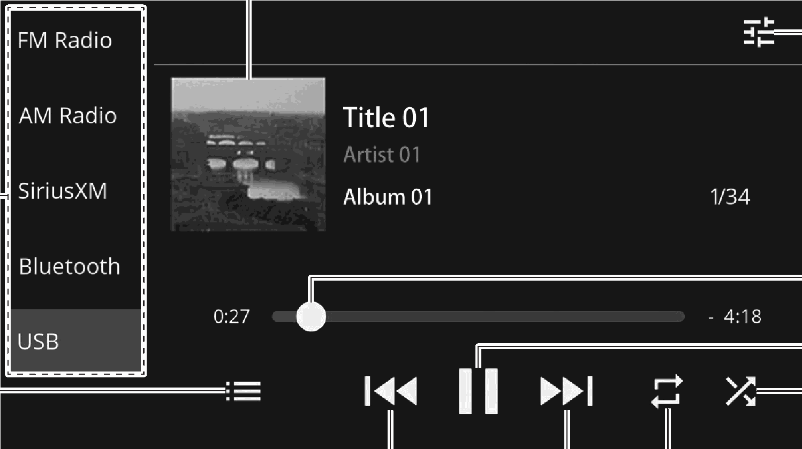

<!-- GENERATED:START function=5584790bd13c (generated; edits inside this block are overwritten by the next publish — write your own notes outside it) -->
# 15. Overview

<b>Function path:</b> Audio / Overview <b>Source:</b> printed page 103, 104 <b>Test-ready:</b> no — procedure missing or thresholds unfilled

Every "Presumed requirement" row below is machine-derived from the Owner's Manual text by rule-based extraction — not AI-written — and traceable to the printed page in its Source column.

## Figures (areas of the original PDF; the OM has no figure numbers or captions)

- Figure 15-1 source: p.103
- (Copied from OM) Select to change audio modes.

## 15-2-1. Service overview

| # | Presumed requirement | Strength | Source |
|---|---|---|---|
| 1 | OverviewThe USB audio playback screen can be accessed with the following methods:. | capability | p.103 / text |

## 15-2-2. Service requirements

| # | Presumed requirement | Strength | Source |
|---|---|---|---|
| 1 | Step -Connect a USB memory device. (Connect to the Type-C terminal) (→P.30). | capability | p.103 / bullet |
| 2 | Step -Touch “USB” on the audio control screen. (→P.19). | capability | p.103 / bullet |
| 3 | Step -Compatible USB memory device: →P.113. | capability | p.103 / bullet |
| 4 | OverviewSelect to change audio modes. | capability | p.103 / text |
| 5 | OverviewDisplays cover art. | capability | p.103 / text |
| 6 | OverviewSelect to display the sound settings screen. (→P.41). | capability | p.103 / text |
| 7 | OverviewShows progress. The playback location can be changed by dragging the sliders. | capability | p.103 / text |
| 8 | OverviewSelect to pause/play. | capability | p.103 / text |
| 9 | OverviewSelect to enable/disable random playback for the tracks currently playing from the USB memory device. | capability | p.103 / text |
| 10 | OverviewChanges between repeat all tracks* → repeat current album/folder → repeat current track → cancel repeat each time this button is selected. | capability | p.104 / text |
| 11 | OverviewSelect to change the track. Select and hold to fast forward/rewind. This function is also available using the / switch on the steering wheel. | capability | p.104 / text |
| 12 | OverviewSelect to display the track search screen. Playback categories, such as by “Artists” or “Albums”, can be selected. | capability | p.104 / text |
| 13 | Overview*: Operable when “Folders” is selected from “[icon]”. | constraint | p.104 / text |
| 14 | Step -Do not operate the player’s controls or connect the USB memory device while driving. | capability | p.104 / bullet |
| 15 | Step -Do not leave your portable player in the vehicle. In particular, high temperatures inside the vehicle may damage the portable player. | capability | p.104 / bullet |
| 16 | Step -Do not push down on or apply unnecessary pressure to the portable player while it is connected as this may damage the portable player or its terminal. | capability | p.104 / bullet |
| 17 | Step -Do not insert foreign objects into the port as this may damage the portable player or its terminal. | capability | p.104 / bullet |

## 15-5. Exception operation

| # | Presumed requirement | Strength | Source |
|---|---|---|---|
| 1 | Step -Depending on the device or music file being played, the cover art may not be displayed. | capability | p.104 / bullet |
<!-- GENERATED:END function=5584790bd13c -->

