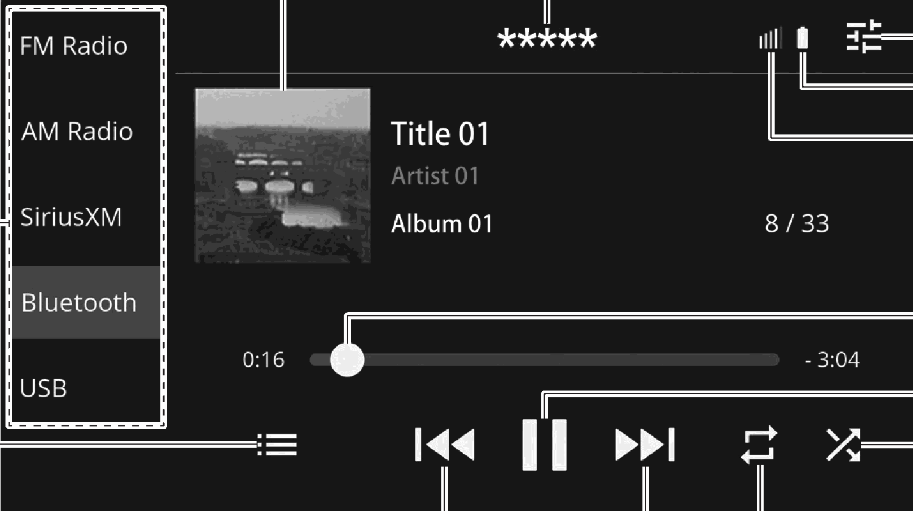

<!-- GENERATED:START function=5584790bd13c (generated; edits inside this block are overwritten by the next publish — write your own notes outside it) -->
# 17. Overview

<b>Function path:</b> Audio / Overview <b>Source:</b> printed page 105, 106, 107 <b>Test-ready:</b> no — procedure missing or thresholds unfilled

Every "Presumed requirement" row below is machine-derived from the Owner's Manual text by rule-based extraction — not AI-written — and traceable to the printed page in its Source column.

## Figures (areas of the original PDF; the OM has no figure numbers or captions)

- Figure 17-1 source: p.105
- (Copied from OM) Select to change audio modes.

## 17-2-1. Service overview

| # | Presumed requirement | Strength | Source |
|---|---|---|---|
| 1 | OverviewThe Bluetooth audio control screen can be accessed by touching “Bluetooth” on the audio control screen. (→P.19) Depending on the type of portable player connected, some functions may not be available and/or the screen may look differently than shown in this manual. | capability | p.105 / text |

## 17-2-2. Service requirements

| # | Presumed requirement | Strength | Source |
|---|---|---|---|
| 1 | Step -If a message is displayed, register/connect according to the content displayed. (→P.55, P.57). | capability | p.105 / bullet |
| 2 | OverviewSelect to change audio modes. | capability | p.105 / text |
| 3 | OverviewDisplays cover art. | capability | p.105 / text |
| 4 | OverviewDisplays the connected Bluetooth device name. | capability | p.105 / text |
| 5 | OverviewSelect to display the sound settings screen. (→P.41). | capability | p.105 / text |
| 6 | OverviewDisplay the remaining of Bluetooth device battery charge. The amount displayed does not always correspond with the amount displayed on the Bluetooth device. | capability | p.106 / text |
| 7 | OverviewShows progress. | capability | p.106 / text |
| 8 | OverviewSelect to pause/play. | capability | p.106 / text |
| 9 | OverviewSelect to enable/disable random playback for the tracks currently playing on the Bluetooth device. | capability | p.106 / text |
| 10 | OverviewChanges between repeat current album/folder → repeat current track → cancel repeat each time this button is selected. | capability | p.106 / text |
| 11 | OverviewSelect to change the track. Select and hold to fast forward/rewind. This function is also available using the / switch on the steering wheel. | capability | p.106 / text |
| 12 | OverviewSelect to display the track search screen. Playback categories, such as by “Artists” or “Albums”, can be selected. | capability | p.106 / text |
| 13 | Step -Do not operate the player’s controls or connect to the Bluetooth audio system while driving. | capability | p.106 / bullet |
| 14 | Step -This system is fitted with Bluetooth antennas. People with implantable cardiac pacemakers, cardiac resynchronization therapy-pacemakers or implantable cardioverter defibrillators should maintain a reasonable distance between themselves and the Bluetooth antennas. The radio waves may affect the operation of such devices. | capability | p.106 / bullet |
| 15 | Step -Before using Bluetooth devices, users of any electrical medical device other than implantable cardiac pacemakers, cardiac resynchronization therapy-pacemakers or implantable cardioverter defibrillators should consult the manufacturer of the device for information about its operation under the influence of radio waves. Radio waves could have unexpected effects on the operation of such medical devices. | capability | p.106 / bullet |
| 16 | Step -Do not leave your portable player in the vehicle. In particular, high temperatures inside the vehicle may damage the portable player. | capability | p.107 / bullet |
| 17 | Step -Depending on the Bluetooth device that is connected to the system, the music may start. | capability | p.107 / bullet |
| 18 | Overviewplaying when touching “[icon]” while it is paused. Conversely, the music may pause when touching “[icon]” while it is playing. | constraint | p.107 / text |
| 19 | Step -The Bluetooth device is turned off. | capability | p.107 / bullet |
| 20 | Step -The Bluetooth device is not connected. | capability | p.107 / bullet |
| 21 | Step -The Bluetooth device has a low battery. | capability | p.107 / bullet |
| 22 | Step -It may take time to connect the phone when Bluetooth audio is being played. | constraint | p.107 / bullet |
| 23 | Step -For operating the portable player, see the instruction manual that comes with it. | capability | p.107 / bullet |
| 24 | Step -If the Bluetooth device is disconnected due to poor reception from the Bluetooth network when the ignition switch is turned to ACC or ON, the system will automatically reconnect to the portable player. | constraint | p.107 / bullet |
| 25 | Step -If the Bluetooth device is disconnected on purpose, such as it was turned off, this does not happen. Reconnect the portable player manually. | capability | p.107 / bullet |
| 26 | Step -Bluetooth device information is registered when the Bluetooth device is connected to the Bluetooth audio system. When transferring ownership of your vehicle, remove the Bluetooth 5 audio information from the system by operating the software settings screen’s item “Factory Data Reset”. (→P.48). | constraint | p.107 / bullet |
| 27 | Step -If the Bluetooth device does not play automatically when connected, device operation may be necessary. | constraint | p.107 / bullet |
| 28 | Step -Operability of all Bluetooth devices with this system is not guaranteed. | capability | p.107 / bullet |
| 29 | Step -Depending on the Bluetooth device connected, irregularities, such as disabled operation of the audio system, inconsistent display with the connected device, longer time required for audio playback, may result. | capability | p.107 / bullet |
| 30 | Step -If a Bluetooth device is enclosed by metal object or in a remote area away from the vehicle’s Bluetooth module, sound quality of the playback may be deteriorated or the wireless communication may be severed. | capability | p.107 / bullet |

## 17-5. Exception operation

| # | Presumed requirement | Strength | Source |
|---|---|---|---|
| 1 | OverviewDisplay the level of phone reception. If a cellular phone is not connected via Bluetooth, this icon will not be displayed. The level of reception does not always correspond with the level displayed on the cellular phone. The level of reception may not be displayed depending on the phone you have. | constraint | p.106 / text |
| 2 | Step -In the following conditions, the system may not function:. | capability | p.107 / bullet |
| 3 | Step -Depending on the Bluetooth device or music file being played, the cover art may not be displayed. | capability | p.107 / bullet |
| 4 | Step -Depending on the music playback application of a Bluetooth device, the Bluetooth audio may not operate properly. | capability | p.107 / bullet |
| 5 | Step -If the specifications or profile of the connected Bluetooth device is lower than recommended or not compatible, the Bluetooth device may not function properly. | capability | p.107 / bullet |
<!-- GENERATED:END function=5584790bd13c -->

