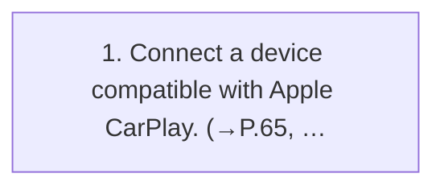

<!-- GENERATED:START function=68b79193ef52 (generated; edits inside this block are overwritten by the next publish — write your own notes outside it) -->
# 19. Connecting an Apple CarPlay device

<b>Function path:</b> Audio / Connecting an Apple CarPlay device <b>Source:</b> printed page 108 <b>Test-ready:</b> yes — no unfilled thresholds and a procedure is present

## Procedure

| Seq | Step | Operation (Copied from OM) | Source |
|---|---|---|---|
| 1 | 1 | Connect a device compatible with Apple CarPlay. (→P.65, 65) | p.108 / step |

<!-- GENERATED:END function=68b79193ef52 -->

