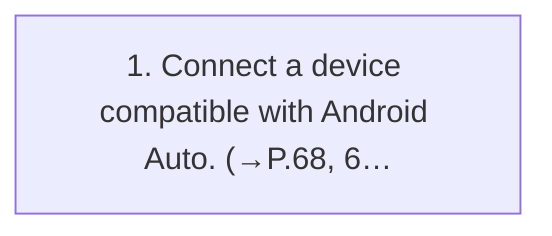

<!-- GENERATED:START function=a822f17914bd (generated; edits inside this block are overwritten by the next publish — write your own notes outside it) -->
# 22. Connecting an Android Auto device

<b>Function path:</b> Audio / Connecting an Android Auto device <b>Source:</b> printed page 110 <b>Test-ready:</b> yes — no unfilled thresholds and a procedure is present

## Procedure

| Seq | Step | Operation (Copied from OM) | Source |
|---|---|---|---|
| 1 | 1 | Connect a device compatible with Android Auto. (→P.68, 69) | p.110 / step |

<!-- GENERATED:END function=a822f17914bd -->

