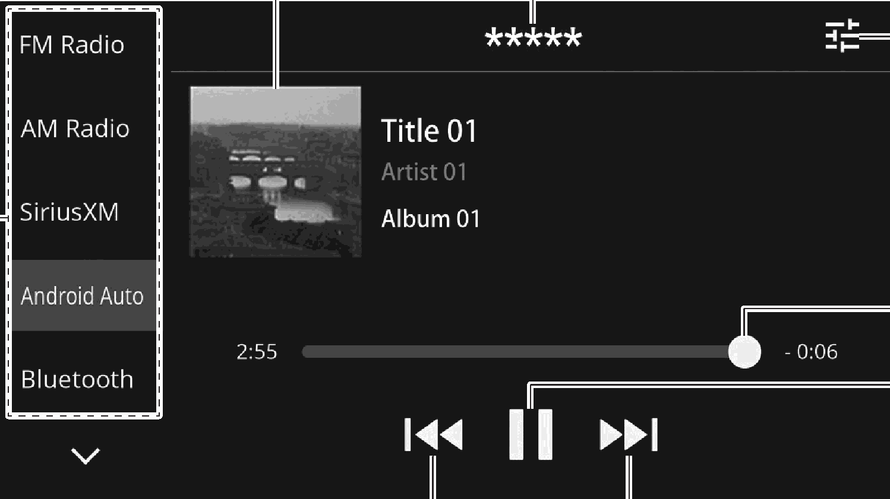

<!-- GENERATED:START function=5584790bd13c (generated; edits inside this block are overwritten by the next publish — write your own notes outside it) -->
# 23. Overview

<b>Function path:</b> Audio / Overview <b>Source:</b> printed page 110, 111 <b>Test-ready:</b> no — procedure missing or thresholds unfilled

Every "Presumed requirement" row below is machine-derived from the Owner's Manual text by rule-based extraction — not AI-written — and traceable to the printed page in its Source column.

## Figures (areas of the original PDF; the OM has no figure numbers or captions)

- Figure 23-1 source: p.110
- (Copied from OM) Select to change audio modes.

## 23-2-1. Service overview

| # | Presumed requirement | Strength | Source |
|---|---|---|---|
| 1 | OverviewTouch “Android Auto” on the audio control screen. (→P.19). | capability | p.110 / text |
| 2 | OverviewSelect to change audio modes. | capability | p.110 / text |
| 3 | OverviewDisplays cover art. Select the cover art to display the Android Auto screen. (→P.70). | capability | p.110 / text |
| 4 | OverviewDisplays the connected Android Auto device name. | capability | p.110 / text |
| 5 | OverviewSelect to display the sound settings screen. (→P.41). | capability | p.110 / text |
| 6 | OverviewShows progress. | capability | p.110 / text |
| 7 | OverviewSelect to pause/play. | capability | p.110 / text |
| 8 | OverviewSelect to change the track. This function is also available using the / switch on the steering wheel. | capability | p.111 / text |

## 23-2-2. Service requirements

| # | Presumed requirement | Strength | Source |
|---|---|---|---|
| 1 | Step -Do not operate or connect an Android Auto device while driving. | capability | p.111 / bullet |
| 2 | Step -This system is fitted with Wi-Fi® antennas. People with implantable cardiac pacemakers, cardiac resynchronization therapy-pacemakers or implantable cardioverter defibrillators should maintain a reasonable distance between themselves and the Wi-Fi® antennas. The radio waves may affect the operation of such devices. | capability | p.111 / bullet |
| 3 | Step -Before using Wi-Fi® devices, users of any electrical medical device other than implantable cardiac pacemakers, cardiac resynchronization therapy-pacemakers or implantable cardioverter defibrillators should consult the manufacturer of the device for information about its operation under the influence of radio waves. Radio waves could have unexpected effects on the operation of such medical devices. | capability | p.111 / bullet |
| 4 | Step -Do not leave your Android Auto device in the vehicle. In particular, high temperatures inside the vehicle may damage it. | capability | p.111 / bullet |
| 5 | Step -Do not push down on or apply unnecessary pressure to the connector area of the Android Auto device while it is connected as this may damage the device or its terminals. | capability | p.111 / bullet |
| 6 | Step -Do not insert foreign objects into the port as this may damage the device or its terminals. | capability | p.111 / bullet |

## 23-5. Exception operation

| # | Presumed requirement | Strength | Source |
|---|---|---|---|
| 1 | Step -Depending on the device or music file being played, the cover art may not be displayed. | capability | p.111 / bullet |
<!-- GENERATED:END function=5584790bd13c -->

