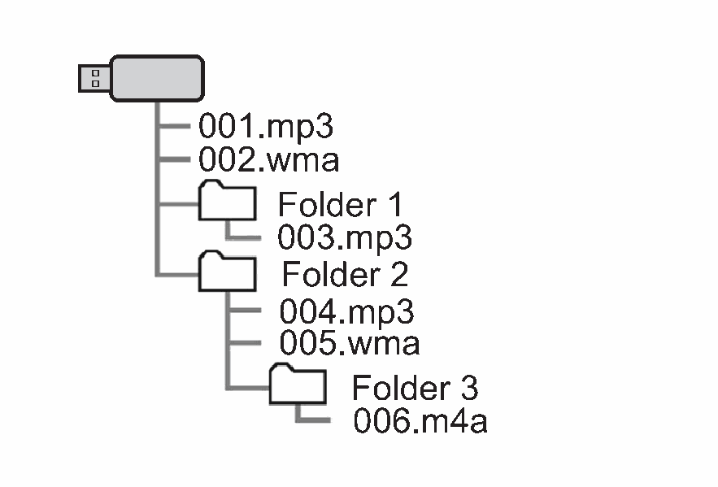

<!-- GENERATED:START function=086a1af648b8 (generated; edits inside this block are overwritten by the next publish — write your own notes outside it) -->
# 27. File information

<b>Function path:</b> Audio / File information <b>Source:</b> printed page 113, 114, 115 <b>Test-ready:</b> no — procedure missing or thresholds unfilled

Every "Presumed requirement" row below is machine-derived from the Owner's Manual text by rule-based extraction — not AI-written — and traceable to the printed page in its Source column.

## Figures (areas of the original PDF; the OM has no figure numbers or captions)

- Figure 27-1 source: p.114
- (Copied from OM) ● The play order may change depending on the personal computer and

## 27-2-1. Service overview

| # | Presumed requirement | Strength | Source |
|---|---|---|---|
| 1 | File informationContainer/ Codec Description Channels Extension 8-48 kHz sampling rate MPEG-4 AAC LC Mono and stereo .m4a, .aac 8-320 kbps CBR, VBR 16-48 kHz sampling rate MPEG-4 HE AAC Mono and stereo .m4a, .aac 8-320 kbps CBR, VBR 16-48 kHz sampling rate MPEG-4 HE AAC v2 Mono and stereo .m4a, .aac 8-320 kbps CBR, VBR 8-48 kHz sampling rate Mono, Stereo, 5 MP3 .mp3 8-320 kbps CBR, VBR and Joint 16-48 kHz sampling rate WMA2/7/8/9/9.1/9.2 Mono and stereo .wma 8-320 kbps CBR, VBR 8 bit and 16 bit PCMWAVE 8000, 16000, and 44100 Hz Mono and stereo .wav sampling frequency 44.1 kHz, 48 kHz, 88.2 kHz, 96 kHz, FLAC 176.4 kHz, 192 kHz sampling rate Mono and stereo .flac 16 bit, 24 bit 44.1 kHz, 48 kHz, 88.2 kHz, 96 kHz, ALAC 176.4 kHz, 192 kHz sampling rate Mono and stereo .m4a 16 bit, 24 bit. | capability | p.113 / text |

## 27-2-2. Service requirements

| # | Presumed requirement | Strength | Source |
|---|---|---|---|
| 1 | Step -The player is compatible with VBR (Variable Bit Rate). | capability | p.113 / bullet |
| 2 | Step -MP3 (MPEG Audio Layer 3), WMA (Windows Media Audio) and AAC (Advanced Audio Coding) are audio compression standards. | capability | p.113 / bullet |
| 3 | Step -This system can play AAC/AAC+ v2/MP3/WMA files on USB memory device and Bluetooth device. | capability | p.113 / bullet |
| 4 | Step -When naming an AAC/AAC+ v2/MP3/WMA file, add an appropriate file extension (.mp3/.wma/.m4a). | capability | p.113 / bullet |
| 5 | Step -WMA/AAC files can contain a WMA/AAC tag that is used in the same way as an ID3 tag. WMA/AAC tags carry information such as file name and artist name. | capability | p.114 / bullet |
| 6 | Step -This system can play back AAC files encoded by iTunes. | capability | p.114 / bullet |
| 7 | Step -The sound quality of MP3/WMA files generally improves with higher bit rates. In order to achieve a reasonable level of sound quality, USB memory device recorded with a bit rate of at least 128 kbps are recommended. | capability | p.114 / bullet |
| 8 | Step -MP3i (MP3 interactive) and MP3PRO formats are not compatible with the audio device. | capability | p.114 / bullet |
| 9 | Step -When playing back files recorded as VBR (Variable Bit Rate) files, the play time will not be correctly displayed if the fast forward or rewind operations are used. | constraint | p.114 / bullet |
| 10 | Step -It is not possible to check folders that do not include AAC/AAC+ v2/MP3/WMA files. | capability | p.114 / bullet |
| 11 | Step -AAC/AAC+ v2/MP3/WMA files in folders up to 3 levels deep can be played. However, the start of playback may be delayed when using USB memory device containing numerous levels of folders. For this reason, we recommend creating USB memory device with no more than 2 levels of folders. | constraint | p.114 / bullet |
| 12 | Step -The play order may change depending on the personal computer and AAC/AAC+ v2/MP3/WMA encoding software that were used. | capability | p.114 / bullet |
| 13 | Step -WMA (Windows Media Audio) is an audio compression format developed by Microsoft®. It compresses files into a size smaller than that of MP3 files. The decoding formats for WMA files are Ver. 7, 8 and 9. This product is protected by certain intellectual property rights of Microsoft Corporation and third parties. Use or distribution of such technology outside of this product is prohibited without a license from Microsoft or an authorized Microsoft subsidiary and third parties. | capability | p.115 / bullet |
| 14 | Step -MP3 is an audio compression standard determined by a working group (MPEG) of the ISO (International Standard Organization). MP3 compresses audio data to about 1/10 the size of that on conventional discs. | capability | p.115 / bullet |

## 27-5. Exception operation

| # | Presumed requirement | Strength | Source |
|---|---|---|---|
| 1 | Step -This system plays back files with .mp3/.wma/.m4a file extensions as AAC/AAC+ v2/MP3/WMA files respectively. To prevent noise and playback errors, use the appropriate file extension. | capability | p.114 / bullet |
| 2 | Step -MP3 files are compatible with the ID3 Tag Ver. 1.0, Ver. 1.1, Ver. 2.2 and Ver. 2.3 formats. This system cannot display folder name, file name and artist name in other formats. | constraint | p.114 / bullet |
<!-- GENERATED:END function=086a1af648b8 -->

