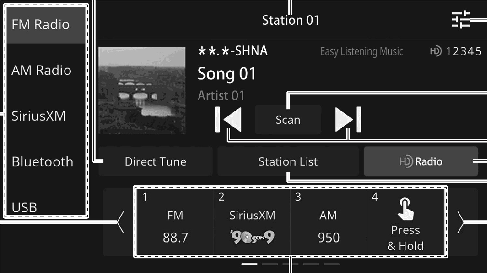

<!-- GENERATED:START function=e0d980f912a6 (generated; edits inside this block are overwritten by the next publish — write your own notes outside it) -->
# 3. Overview

<b>Function path:</b> Audio / Overview <b>Source:</b> printed page 90, 91, 92 <b>Test-ready:</b> no — procedure missing or thresholds unfilled

Every "Presumed requirement" row below is machine-derived from the Owner's Manual text by rule-based extraction — not AI-written — and traceable to the printed page in its Source column.

## Figures (areas of the original PDF; the OM has no figure numbers or captions)

- Figure 3-1 source: p.91
- (Copied from OM) Select to change audio modes. 5

## 3-2-1. Service overview

| # | Presumed requirement | Strength | Source |
|---|---|---|---|
| 1 | OverviewThe FM/AM radio operation screen can be accessed by touching “FM Radio” or “AM Radio” on the audio control screen. (→P.19). | capability | p.90 / text |
| 2 | OverviewSelect to change audio modes. 5. | capability | p.91 / text |
| 3 | OverviewSelect to search for stations by entering frequency number. | capability | p.91 / text |
| 4 | OverviewDisplays the name of the broadcasting station. | capability | p.91 / text |
| 5 | OverviewSelect to display the sound settings screen. (→P.41). | capability | p.91 / text |
| 6 | OverviewSelect to scan for receivable stations/channels. The scan will continue until selected again. | capability | p.91 / text |
| 7 | OverviewSelect to step up/down frequencies. Select and hold to seek frequencies. This function is also available using the / switch on the steering wheel. | capability | p.91 / text |
| 8 | OverviewSelect to change multicast channels available.* (→P.93). | capability | p.91 / text |
| 9 | OverviewSelect to turn HD Radio mode on/off. (→P.93). | capability | p.91 / text |
| 10 | OverviewSelect to display a list of receivable stations. (→P.92). | capability | p.91 / text |
| 11 | OverviewSelect to scroll the list of preset buttons. | capability | p.91 / text |
| 12 | OverviewSelect to tune to preset stations/channels. (Preset stations/channels can also be changed using the / switch on the steering wheel.) The preset station list can be scrolled by swiping the list. | capability | p.92 / text |
| 13 | Overview*: FM radio only. | capability | p.92 / text |

## 3-2-2. Service requirements

| # | Presumed requirement | Strength | Source |
|---|---|---|---|
| 1 | Step -The radio automatically changes to stereo reception when a stereo broadcast is received. | constraint | p.92 / bullet |
| 2 | Step -When the HD Radio mode is on, the radio automatically tunes to an HD Radio signal in AM or FM where available. | capability | p.92 / bullet |
<!-- GENERATED:END function=e0d980f912a6 -->

