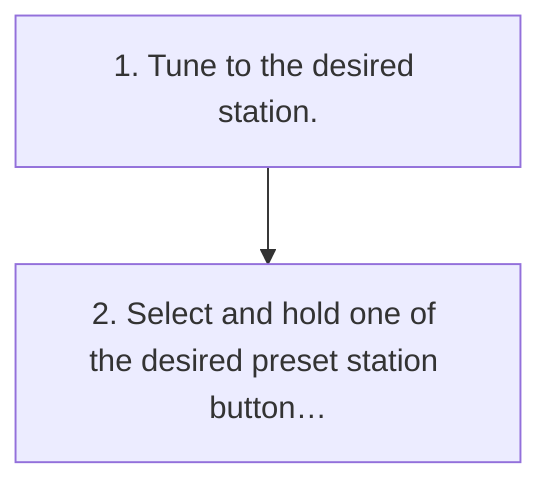

<!-- GENERATED:START function=0d02ef758518 (generated; edits inside this block are overwritten by the next publish — write your own notes outside it) -->
# 4. Registering a station as a preset

<b>Function path:</b> Audio / Registering a station as a preset <b>Source:</b> printed page 92 <b>Test-ready:</b> yes — no unfilled thresholds and a procedure is present

Every "Presumed requirement" row below is machine-derived from the Owner's Manual text by rule-based extraction — not AI-written — and traceable to the printed page in its Source column.

## Procedure

| Seq | Step | Operation (Copied from OM) | Source |
|---|---|---|---|
| 1 | 1 | Tune to the desired station. | p.92 / step |
| 2 | 2 | Select and hold one of the desired preset station buttons. | p.92 / step |

## 4-2-1. Service overview

| # | Presumed requirement | Strength | Source |
|---|---|---|---|
| 1 | Registering a station as a presetMultiple stations can be registered as presets. | capability | p.92 / text |

## 4-2-2. Service requirements

| # | Presumed requirement | Strength | Source |
|---|---|---|---|
| 1 | Step -To change the preset station to a different one, follow the same procedure. | capability | p.92 / bullet |
<!-- GENERATED:END function=0d02ef758518 -->

