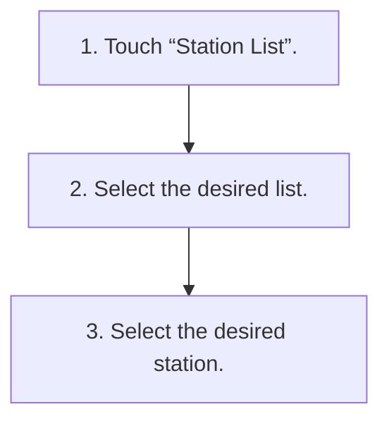

<!-- GENERATED:START function=a42c74459897 (generated; edits inside this block are overwritten by the next publish — write your own notes outside it) -->
# 5. Selecting a station from the list

<b>Function path:</b> Audio / Selecting a station from the list <b>Source:</b> printed page 92 <b>Test-ready:</b> yes — no unfilled thresholds and a procedure is present

Every "Presumed requirement" row below is machine-derived from the Owner's Manual text by rule-based extraction — not AI-written — and traceable to the printed page in its Source column.

## Procedure

| Seq | Step | Operation (Copied from OM) | Source |
|---|---|---|---|
| 1 | 1 | Touch “Station List”. | p.92 / step |
| 2 | 2 | Select the desired list. | p.92 / step |
| 3 | 3 | Select the desired station. | p.92 / step |

## 5-2-1. Service overview

| # | Presumed requirement | Strength | Source |
|---|---|---|---|
| 1 | Selecting a station from the listA station list can be displayed. | capability | p.92 / text |

## 5-2-2. Service requirements

| # | Presumed requirement | Strength | Source |
|---|---|---|---|
| 1 | Step -“[icon]”: Select to update the station list. | capability | p.92 / bullet |
| 2 | Selecting a station from the listFM radio only. | capability | p.92 / text |
| 3 | Step -“All”: Select to display all stations. | capability | p.92 / bullet |
| 4 | Step -“Genres”: Select to display categories. | capability | p.92 / bullet |
<!-- GENERATED:END function=a42c74459897 -->

