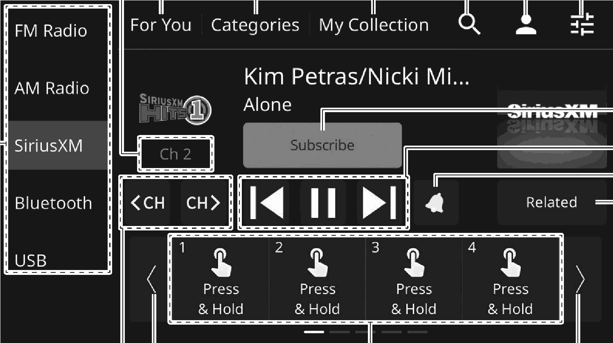

<!-- GENERATED:START function=5584790bd13c (generated; edits inside this block are overwritten by the next publish — write your own notes outside it) -->
# 8. Overview

<b>Function path:</b> Audio / Overview <b>Source:</b> printed page 94, 95, 96 <b>Test-ready:</b> no — procedure missing or thresholds unfilled

Every "Presumed requirement" row below is machine-derived from the Owner's Manual text by rule-based extraction — not AI-written — and traceable to the printed page in its Source column.

## Figures (areas of the original PDF; the OM has no figure numbers or captions)

- Figure 8-1 source: p.95
- (Copied from OM) Select to change audio modes. 5

## 8-2-1. Service overview

| # | Presumed requirement | Strength | Source |
|---|---|---|---|
| 1 | OverviewThe SiriusXM® operation screen can be accessed by touching “SiriusXM” on the audio control screen. (→P.19) When the SiriusXM® operation screen is displayed, contents personalized for the logged-in user will be suggested. To use this function, enable the start up recommendations function. (→P.102). | constraint | p.94 / text |
| 2 | OverviewSelect to change audio modes. 5. | capability | p.95 / text |
| 3 | OverviewDisplays a list of suggested contents for the user based on the content being played back and the listener profile. Select the desired content to play it. Select and hold a content to register it to “Favorites” of “My Collection”. | capability | p.95 / text |
| 4 | OverviewSelect the desired content from each of “Music”, “Sports”, “News”, and “Talk” categories. | capability | p.95 / text |

## 8-2-2. Service requirements

| # | Presumed requirement | Strength | Source |
|---|---|---|---|
| 1 | Step -“Music”, “Sports”, “Talk”: Select a category and touch “Channels”/“On Demand” to change between a channel list/episode list. Then select the desired content to play it. | capability | p.95 / bullet |
| 2 | Step -“News”: Select a news category to display a channel list and then select the desired content. | capability | p.95 / bullet |
| 3 | Step -Select and hold a content to register it to “Favorites” of “My Collection”. | capability | p.95 / bullet |
| 4 | Step -“Favorites”: Select a content from the list of registered contents to play it. ―“Add”: Select to register the content being played back to “Favorites”. ―“Edit”: Select to delete/change the sequence of the contents. | capability | p.95 / bullet |
| 5 | Step -“Artist”: Select a content from the list of registered contents to play it. ―“Edit”: Select to delete the content(s). | capability | p.95 / bullet |
| 6 | Step -“History”: Select a content from the list of registered contents to play it. Select and hold a content to register it to “Favorites”. | capability | p.95 / bullet |
| 7 | OverviewSelect to display the search screen. (→P.99). | capability | p.95 / text |
| 8 | OverviewSelect to display the SiriusXM® setting screen. (→P.100). | capability | p.96 / text |
| 9 | OverviewSelect to display the sound settings screen. (→P.41). | capability | p.96 / text |
| 10 | OverviewSelect to search channels by entering the channel number. | capability | p.96 / text |
| 11 | OverviewSelect to subscribe to the SiriusXM®. Select the desired method displayed on the screen to proceed to the subscription procedure. | capability | p.96 / text |
| 12 | OverviewSelect to display currently available contents and then select a content to play it. Pressing and holding the / switch on the steering wheel will change contents in succession. Select and hold a content to register it to “Favorites”. | capability | p.96 / text |
| 13 | Step -“Direct Tune”: The channel list screen can be changed to channel number entering screen to search a channel. | capability | p.96 / bullet |
| 14 | Step -“Categories”: Touch “Music”/“Sports”/“News”/“Talk” to display the contents of the selected category. | capability | p.96 / bullet |
| 15 | OverviewSelect to operate previous content of the currently selected channel that is cashed in the system. | capability | p.96 / text |
| 16 | Step -“[icon]”: Select to skip back the cashed content. | capability | p.96 / bullet |
| 17 | Step -“[icon]”/“[icon]”: Select to pause/release pause of the cached content playback. | capability | p.96 / bullet |
| 18 | Step -“[icon]”: Select to skip forward the cashed content. | capability | p.96 / bullet |
| 19 | OverviewSelect to enable/disable notification of registered sports teams or music artists/tunes, such as their game match starting time or tune to be played. | capability | p.96 / text |
| 20 | OverviewSelect to display a list of contents related to the current content you are listening to. *. | capability | p.96 / text |
| 21 | OverviewSelect to scroll the list of preset buttons. | capability | p.96 / text |
| 22 | OverviewSelect to tune to preset channels. (Preset channels can also be changed using the / switch on the steering wheel.) The preset channel list can be scrolled by swiping the list. | capability | p.96 / text |
| 23 | Overview*: For content distributed on-demand and online, “More Episodes” may be displayed instead of “Related” on this screen button. | capability | p.96 / text |
<!-- GENERATED:END function=5584790bd13c -->

