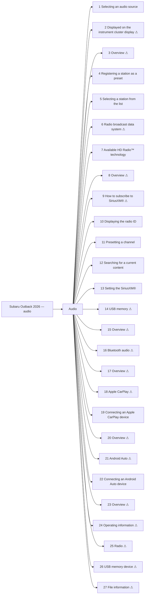

<!-- GENERATED:START index (generated; edits inside this block are overwritten by the next publish — write your own notes outside it) -->
# Subaru Outback 2026 — audio — Presumed specification

> This is a machine-derived estimate, not an official requirements document. Numeric thresholds left blank could not be found in the manual and must be filled in by a tester with evidence.

| Field | Value |
|---|---|
| Maker / Model | Subaru / Outback 2026 |
| Scope | audio |
| Markets | US, CA |
| Profile | subaru_v1 |
| Manual ID | subaru/outback-2026/ivi |

## Numeric thresholds
Filled: 0 / Unfilled: 2

## Figures in the manual
10 figure area(s) detected.

## Functions

| No. | Function | Area | Requirements | Figures | Unfilled thresholds | Test-ready |
|---|---|---|---|---|---|---|
| 1 | Selecting an audio source | Audio | 0 | 0 | 0 | o |
| 2 | Displayed on the instrument cluster display | Audio | 1 | 0 | 0 | - |
| 3 | Overview | Audio | 15 | 1 | 0 | - |
| 4 | Registering a station as a preset | Audio | 2 | 0 | 0 | o |
| 5 | Selecting a station from the list | Audio | 5 | 0 | 0 | o |
| 6 | Radio broadcast data system | Audio | 3 | 0 | 0 | - |
| 7 | Available HD Radio™ technology | Audio | 12 | 0 | 0 | o |
| 8 | Overview | Audio | 27 | 1 | 0 | - |
| 9 | How to subscribe to SiriusXM® | Audio | 14 | 0 | 0 | - |
| 10 | Displaying the radio ID | Audio | 2 | 0 | 0 | o |
| 11 | Presetting a channel | Audio | 2 | 0 | 0 | o |
| 12 | Searching for a current content | Audio | 18 | 1 | 0 | o |
| 13 | Setting the SiriusXM® | Audio | 19 | 2 | 0 | o |
| 14 | USB memory | Audio | 1 | 0 | 0 | - |
| 15 | Overview | Audio | 19 | 1 | 0 | - |
| 16 | Bluetooth audio | Audio | 3 | 0 | 0 | - |
| 17 | Overview | Audio | 36 | 1 | 0 | - |
| 18 | Apple CarPlay | Audio | 1 | 0 | 0 | - |
| 19 | Connecting an Apple CarPlay device | Audio | 0 | 0 | 0 | o |
| 20 | Overview | Audio | 16 | 1 | 0 | - |
| 21 | Android Auto | Audio | 1 | 0 | 0 | - |
| 22 | Connecting an Android Auto device | Audio | 0 | 0 | 0 | o |
| 23 | Overview | Audio | 15 | 1 | 0 | - |
| 24 | Operating information | Audio | 2 | 0 | 0 | - |
| 25 | Radio | Audio | 11 | 0 | 2 | - |
| 26 | USB memory device | Audio | 3 | 0 | 0 | - |
| 27 | File information | Audio | 17 | 1 | 0 | - |
<!-- GENERATED:END index -->

