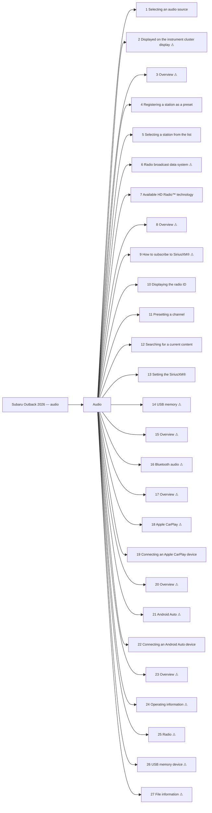

<!-- GENERATED:START index (generated; edits inside this block are overwritten by the next publish — write your own notes outside it) -->
# Subaru Outback 2026 — audio — Presumed specification

> This is a machine-derived estimate, not an official requirements document. Numeric thresholds left blank could not be found in the manual and must be filled in by a tester with evidence.

| Field | Value |
|---|---|
| Maker / Model | Subaru / Outback 2026 |
| Scope | audio |
| Markets | US, CA |
| Profile | subaru_v1 |
| Manual ID | subaru/outback-2026/ivi |

## Numeric thresholds

- Thresholds detected: **2**
- Filled: **0** / unfilled: **2**
- Test-ready functions: **10 / 27**

The manual states almost no numbers, so a tester fills the thresholds in. A function that still has an unfilled threshold cannot become a test specification (`is_test_ready=false`). Fill them in `overlay/thresholds.yaml` or on the screen.

## Figures in the manual

- Figures: **10** / images rendered: **10**

Each image is a rendering of the corresponding area of the original PDF. **Images are not kept in the repository** (they are copies of another company's manual); `publish` creates them under `../figures/` on the machine that runs it.

## Glossary (registered by a reviewer)

How wording in the manual maps to the in-house term. **The original text is not rewritten** — the mapping is only annotated here. Register terms on the Glossary screen. Evidence (why the mapping holds) is required.

| In-house term | Category | Wording in the manual | Hits | Evidence |
|---|---|---|---:|---|
| AA | abbreviation | `Android Auto` | 9 | Counted by string match over workspace/subaru/**/published/*.md (2026-09-01): outback-2026 31 / outback-2025 24 / ascent-2026 1. Always printed in full ("Android Auto") — no abbreviated form appears in the manual text; "AA" is an in-house-only abbreviation. |

## Functions

| No. | Function | Area | Requirements | Figures | Unfilled thresholds | Test-ready |
|---|---|---|---|---|---|---|
| 1 | [Selecting an audio source](/specifications/subaru/outback-2026/ivi/file/1-selecting-an-audio-source.md?chapter=audio) | Audio | 0 | 0 | 0 | o |
| 2 | [Displayed on the instrument cluster display](/specifications/subaru/outback-2026/ivi/file/2-displayed-on-the-instrument-cluster-display.md?chapter=audio) | Audio | 1 | 0 | 0 | - |
| 3 | [Overview](/specifications/subaru/outback-2026/ivi/file/3-overview.md?chapter=audio) | Audio | 15 | 1 | 0 | - |
| 4 | [Registering a station as a preset](/specifications/subaru/outback-2026/ivi/file/4-registering-a-station-as-a-preset.md?chapter=audio) | Audio | 2 | 0 | 0 | o |
| 5 | [Selecting a station from the list](/specifications/subaru/outback-2026/ivi/file/5-selecting-a-station-from-the-list.md?chapter=audio) | Audio | 5 | 0 | 0 | o |
| 6 | [Radio broadcast data system](/specifications/subaru/outback-2026/ivi/file/6-radio-broadcast-data-system.md?chapter=audio) | Audio | 3 | 0 | 0 | - |
| 7 | [Available HD Radio™ technology](/specifications/subaru/outback-2026/ivi/file/7-available-hd-radiotm-technology.md?chapter=audio) | Audio | 12 | 0 | 0 | o |
| 8 | [Overview](/specifications/subaru/outback-2026/ivi/file/8-overview.md?chapter=audio) | Audio | 27 | 1 | 0 | - |
| 9 | [How to subscribe to SiriusXM®](/specifications/subaru/outback-2026/ivi/file/9-how-to-subscribe-to-siriusxm.md?chapter=audio) | Audio | 14 | 0 | 0 | - |
| 10 | [Displaying the radio ID](/specifications/subaru/outback-2026/ivi/file/10-displaying-the-radio-id.md?chapter=audio) | Audio | 2 | 0 | 0 | o |
| 11 | [Presetting a channel](/specifications/subaru/outback-2026/ivi/file/11-presetting-a-channel.md?chapter=audio) | Audio | 2 | 0 | 0 | o |
| 12 | [Searching for a current content](/specifications/subaru/outback-2026/ivi/file/12-searching-for-a-current-content.md?chapter=audio) | Audio | 18 | 1 | 0 | o |
| 13 | [Setting the SiriusXM®](/specifications/subaru/outback-2026/ivi/file/13-setting-the-siriusxm.md?chapter=audio) | Audio | 19 | 2 | 0 | o |
| 14 | [USB memory](/specifications/subaru/outback-2026/ivi/file/14-usb-memory.md?chapter=audio) | Audio | 1 | 0 | 0 | - |
| 15 | [Overview](/specifications/subaru/outback-2026/ivi/file/15-overview.md?chapter=audio) | Audio | 19 | 1 | 0 | - |
| 16 | [Bluetooth audio](/specifications/subaru/outback-2026/ivi/file/16-bluetooth-audio.md?chapter=audio) | Audio | 3 | 0 | 0 | - |
| 17 | [Overview](/specifications/subaru/outback-2026/ivi/file/17-overview.md?chapter=audio) | Audio | 36 | 1 | 0 | - |
| 18 | [Apple CarPlay](/specifications/subaru/outback-2026/ivi/file/18-apple-carplay.md?chapter=audio) | Audio | 1 | 0 | 0 | - |
| 19 | [Connecting an Apple CarPlay device](/specifications/subaru/outback-2026/ivi/file/19-connecting-an-apple-carplay-device.md?chapter=audio) | Audio | 0 | 0 | 0 | o |
| 20 | [Overview](/specifications/subaru/outback-2026/ivi/file/20-overview.md?chapter=audio) | Audio | 16 | 1 | 0 | - |
| 21 | [Android Auto](/specifications/subaru/outback-2026/ivi/file/21-android-auto.md?chapter=audio) | Audio | 1 | 0 | 0 | - |
| 22 | [Connecting an Android Auto device](/specifications/subaru/outback-2026/ivi/file/22-connecting-an-android-auto-device.md?chapter=audio) | Audio | 0 | 0 | 0 | o |
| 23 | [Overview](/specifications/subaru/outback-2026/ivi/file/23-overview.md?chapter=audio) | Audio | 15 | 1 | 0 | - |
| 24 | [Operating information](/specifications/subaru/outback-2026/ivi/file/24-operating-information.md?chapter=audio) | Audio | 2 | 0 | 0 | - |
| 25 | [Radio](/specifications/subaru/outback-2026/ivi/file/25-radio.md?chapter=audio) | Audio | 11 | 0 | 2 | - |
| 26 | [USB memory device](/specifications/subaru/outback-2026/ivi/file/26-usb-memory-device.md?chapter=audio) | Audio | 3 | 0 | 0 | - |
| 27 | [File information](/specifications/subaru/outback-2026/ivi/file/27-file-information.md?chapter=audio) | Audio | 17 | 1 | 0 | - |
<!-- GENERATED:END index -->

