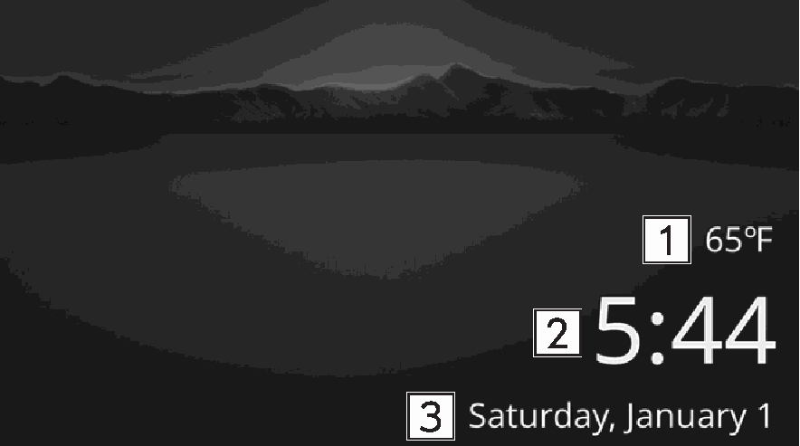

<!-- GENERATED:START function=a5944e1f90d7 (generated; edits inside this block are overwritten by the next publish — write your own notes outside it) -->
# 10. Calm screen

<b>Function path:</b> Basic operation / Calm screen <b>Source:</b> printed page 23, 24 <b>Test-ready:</b> no — procedure missing or thresholds unfilled

Every "Presumed requirement" row below is machine-derived from the Owner's Manual text by rule-based extraction — not AI-written — and traceable to the printed page in its Source column.

## Figures (areas of the original PDF; the OM has no figure numbers or captions)

- Figure 10-1 source: p.23
- (Copied from OM) Outside temperature

## 10-2-1. Service overview

| # | Presumed requirement | Strength | Source |
|---|---|---|---|
| 1 | Calm screenOutside temperature. | capability | p.23 / text |

## 10-2-2. Service requirements

| # | Presumed requirement | Strength | Source |
|---|---|---|---|
| 1 | Step -Unit of measurements displayed can be changed. Refer to the vehicle Owner’s Manual for details. | capability | p.23 / bullet |
| 2 | Step -Select to display the clock setting screen. Refer to the vehicle Owner’s Manual for details. | capability | p.24 / bullet |
| 3 | Calm screenDate and day of the week. | capability | p.24 / text |
<!-- GENERATED:END function=a5944e1f90d7 -->

