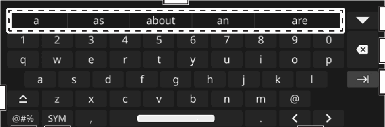

<!-- GENERATED:START function=cf904db19713 (generated; edits inside this block are overwritten by the next publish — write your own notes outside it) -->
# 13. Entering letters and numbers

<b>Function path:</b> Basic operation / Entering letters and numbers <b>Source:</b> printed page 27, 28 <b>Test-ready:</b> no — procedure missing or thresholds unfilled

Every "Presumed requirement" row below is machine-derived from the Owner's Manual text by rule-based extraction — not AI-written — and traceable to the printed page in its Source column.

## Figures (areas of the original PDF; the OM has no figure numbers or captions)

- Figure 13-1 source: p.27
- (Copied from OM) Display predictive entries.*

## 13-2-1. Service overview

| # | Presumed requirement | Strength | Source |
|---|---|---|---|
| 1 | Entering letters and numbersWhen entering data, letters and numbers can be entered via the screen. | capability | p.27 / text |
| 2 | Entering letters and numbersDisplay predictive entries.*. | capability | p.27 / text |
| 3 | Entering letters and numbersSelect to display predictive entries in full screen mode.*. | capability | p.27 / text |
| 4 | Entering letters and numbersSelect to erase one character. | capability | p.27 / text |
| 5 | Entering letters and numbersSelect to enter the item. | capability | p.27 / text |
| 6 | Entering letters and numbersSelect to move the cursor. | capability | p.27 / text |
| 7 | Entering letters and numbersSelect to display all of the available symbols. | capability | p.27 / text |
| 8 | Entering letters and numbersSelect to enter symbols. | capability | p.27 / text |
| 9 | Entering letters and numbersSelect to enter characters in lower case or in upper case. | capability | p.28 / text |

## 13-2-2. Service requirements

| # | Presumed requirement | Strength | Source |
|---|---|---|---|
| 1 | Step -“[icon]”: Enables capital letter input of one character only. | capability | p.28 / bullet |
| 2 | Step -“[icon]”: Enables capital letter input successively. | capability | p.28 / bullet |

## 13-5. Exception operation

| # | Presumed requirement | Strength | Source |
|---|---|---|---|
| 1 | Entering letters and numbers*: Depending on the function used, predictive entries may not be displayed. | capability | p.28 / text |
<!-- GENERATED:END function=cf904db19713 -->

