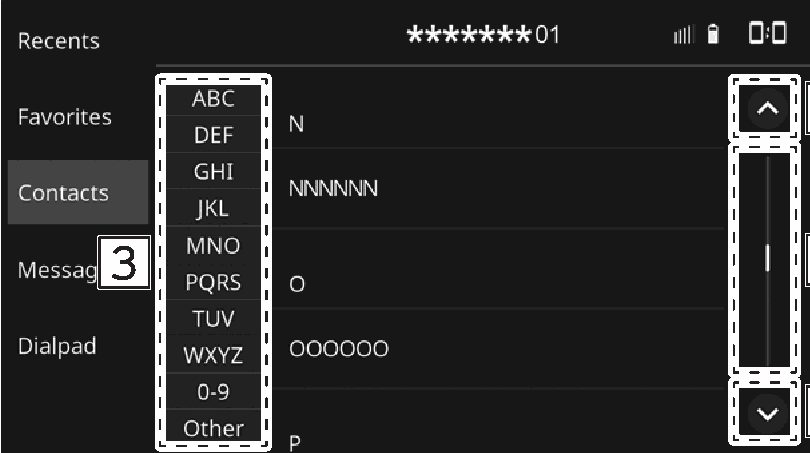

<!-- GENERATED:START function=67b4190dcaaa (generated; edits inside this block are overwritten by the next publish — write your own notes outside it) -->
# 14. List screen operation

<b>Function path:</b> Basic operation / List screen operation <b>Source:</b> printed page 28 <b>Test-ready:</b> no — procedure missing or thresholds unfilled

Every "Presumed requirement" row below is machine-derived from the Owner's Manual text by rule-based extraction — not AI-written — and traceable to the printed page in its Source column.

## Figures (areas of the original PDF; the OM has no figure numbers or captions)

- Figure 14-1 source: p.28
- (Copied from OM) Select to skip to the next or previous page.

## 14-2-1. Service overview

| # | Presumed requirement | Strength | Source |
|---|---|---|---|
| 1 | List screen operationThe list screen can be scrolled by a swipe gesture. | capability | p.28 / text |
| 2 | List screen operationFor details on the operation: →P.24. | capability | p.28 / text |
| 3 | List screen operationSelect to skip to the next or previous page. | capability | p.28 / text |
| 4 | List screen operationThis indicates the displayed screen’s position. To scroll: Drag the position indicator. To jump: Select the desired position of the rail. | capability | p.28 / text |
| 5 | List screen operationSome lists contain character screen buttons which allow users to jump directly to list entries that begin with the same letter as the character screen button. Every time the same character screen button is selected, the list starting with the subsequent character is displayed. | capability | p.28 / text |
<!-- GENERATED:END function=67b4190dcaaa -->

