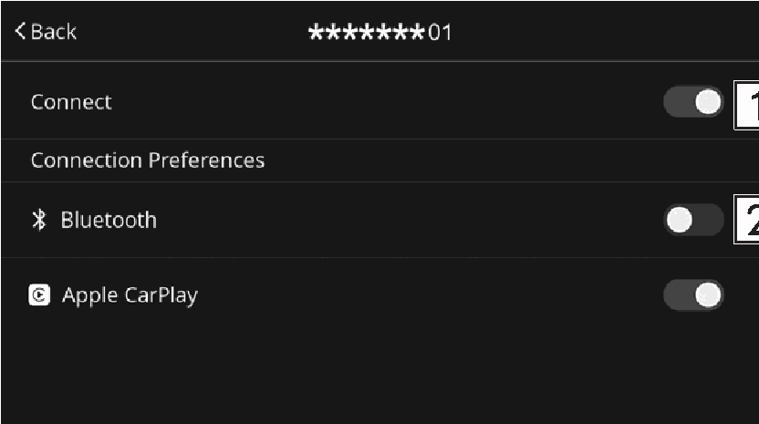

<!-- GENERATED:START function=572bb074fb99 (generated; edits inside this block are overwritten by the next publish — write your own notes outside it) -->
# 15. Enabling and disabling the settings

<b>Function path:</b> Basic operation / Enabling and disabling the settings <b>Source:</b> printed page 28, 29 <b>Test-ready:</b> no — procedure missing or thresholds unfilled

Every "Presumed requirement" row below is machine-derived from the Owner's Manual text by rule-based extraction — not AI-written — and traceable to the printed page in its Source column.

## Figures (areas of the original PDF; the OM has no figure numbers or captions)

- Figure 15-1 source: p.29
- (Copied from OM) OFF

## 15-2-1. Service overview

| # | Presumed requirement | Strength | Source |
|---|---|---|---|
| 1 | Enabling and disabling the settingsSelect the icon on the right of the desired item. | capability | p.28 / text |
<!-- GENERATED:END function=572bb074fb99 -->

