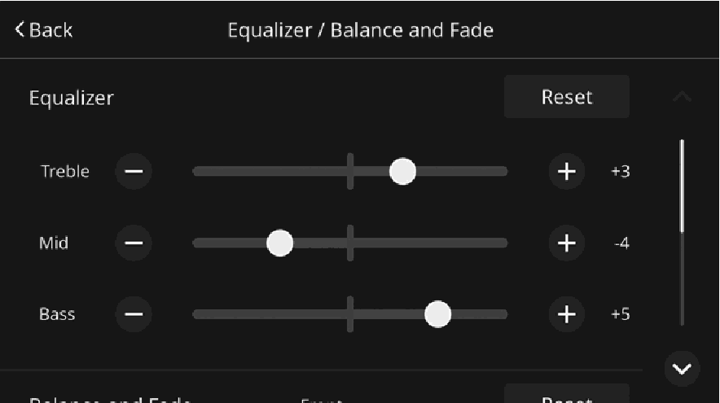

<!-- GENERATED:START function=83325b0665f0 (generated; edits inside this block are overwritten by the next publish — write your own notes outside it) -->
# 16. Adjusting the levels

<b>Function path:</b> Basic operation / Adjusting the levels <b>Source:</b> printed page 29 <b>Test-ready:</b> no — procedure missing or thresholds unfilled

Every "Presumed requirement" row below is machine-derived from the Owner's Manual text by rule-based extraction — not AI-written — and traceable to the printed page in its Source column.

## Figures (areas of the original PDF; the OM has no figure numbers or captions)

- Figure 16-1 source: p.29
- (Copied from OM) drag the icon.

## 16-2-1. Service overview

| # | Presumed requirement | Strength | Source |
|---|---|---|---|
| 1 | Adjusting the levelsTo adjust the levels, select the desired place of the screen bar, touch “[icon]” / “[icon]”, or drag the icon. | capability | p.29 / text |
<!-- GENERATED:END function=83325b0665f0 -->

