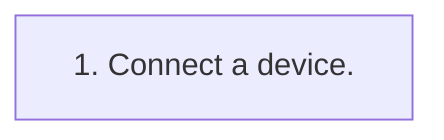

<!-- GENERATED:START function=f772422068d8 (generated; edits inside this block are overwritten by the next publish — write your own notes outside it) -->
# 17. Connecting a USB memory device

<b>Function path:</b> Basic operation / Connecting a USB memory device <b>Source:</b> printed page 30 <b>Test-ready:</b> yes — no unfilled thresholds and a procedure is present

Every "Presumed requirement" row below is machine-derived from the Owner's Manual text by rule-based extraction — not AI-written — and traceable to the printed page in its Source column.

## Procedure

| Seq | Step | Operation (Copied from OM) | Source |
|---|---|---|---|
| 1 | 1 | Connect a device. | p.30 / step |

## 17-2-2. Service requirements

| # | Presumed requirement | Strength | Source |
|---|---|---|---|
| 1 | Step -Turn on the power of the device if it is not turned on. | constraint | p.30 / bullet |
| 2 | Step -Compatible USB memory device: →P.113. | capability | p.30 / bullet |
| 3 | Step -This unit does not support commercially available USB hubs. | capability | p.30 / bullet |
| 4 | Step -By connecting a device such as a cellular phone, charging starts depending on the device. | capability | p.30 / bullet |
| 5 | Step -As the Type-A terminal is for charging only, connect to the Type-C terminal for data/signal communication. | capability | p.30 / bullet |
<!-- GENERATED:END function=f772422068d8 -->

