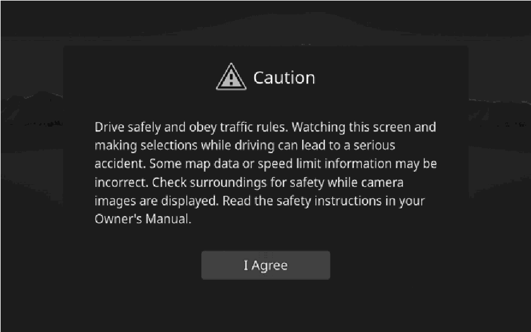
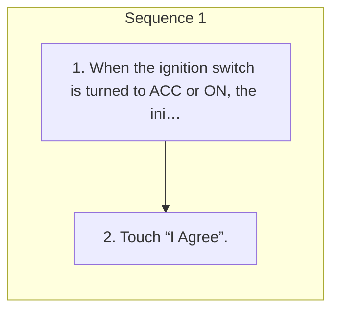

<!-- GENERATED:START function=b91711464c99 (generated; edits inside this block are overwritten by the next publish — write your own notes outside it) -->
# 2. Initial screen

<b>Function path:</b> Basic operation / Initial screen <b>Source:</b> printed page 16, 17 <b>Test-ready:</b> no — procedure missing or thresholds unfilled

Every "Presumed requirement" row below is machine-derived from the Owner's Manual text by rule-based extraction — not AI-written — and traceable to the printed page in its Source column.

## Figures (areas of the original PDF; the OM has no figure numbers or captions)

- Figure 2-1 source: p.17
- (Copied from OM) Touch “I Agree”.

## Procedure

| Seq | Step | Operation (Copied from OM) | Source |
|---|---|---|---|
| 1 | 1 | When the ignition switch is turned to ACC or ON, the initial screen will be displayed and the system will begin operating. | p.16 / step |
| 1 | 2 | Touch “I Agree”. | p.17 / step |

## Numeric thresholds (filled in by a tester)
Filled: 0 / unfilled: 1

| Threshold | Matching text (Copied from OM) | Kind | Unit | Value | Status | Evidence | Filled by |
|---|---|---|---|---|---|---|---|
| 61bf95fcbe91 | a few seconds | duration | seconds | **unfilled** | unfilled | Reverting test entry | Claude test |

## 2-2-2. Service requirements

| # | Presumed requirement | Strength | Source |
|---|---|---|---|
| 1 | Step -When the vehicle is stopped with the engine running, always apply the parking brake for safety. | capability | p.16 / bullet |

## 2-5. Exception operation

| # | Presumed requirement | Strength | Source |
|---|---|---|---|
| 1 | Step -After a few seconds, the “Caution” screen will be displayed. | capability | p.16 / bullet |
<!-- GENERATED:END function=b91711464c99 -->

