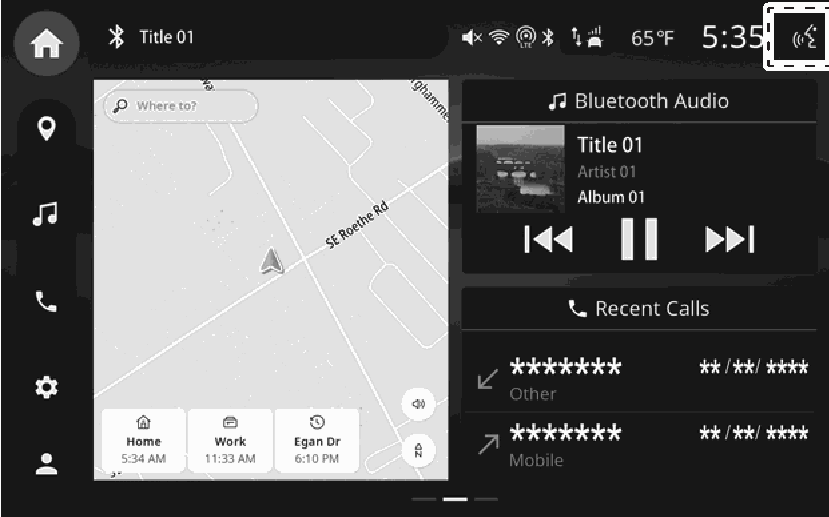
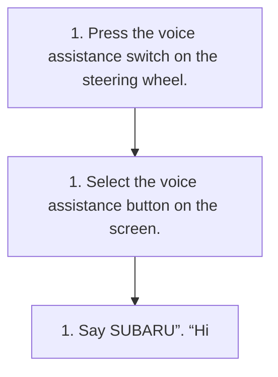

<!-- GENERATED:START function=ecf8ca696b8a (generated; edits inside this block are overwritten by the next publish — write your own notes outside it) -->
# 20. Using the voice assistance system

<b>Function path:</b> Basic operation / Using the voice assistance system <b>Source:</b> printed page 32, 33 <b>Test-ready:</b> yes — no unfilled thresholds and a procedure is present

Every "Presumed requirement" row below is machine-derived from the Owner's Manual text by rule-based extraction — not AI-written — and traceable to the printed page in its Source column.

## Figures (areas of the original PDF; the OM has no figure numbers or captions)

- Figure 20-1 source: p.32
- (Copied from OM) the screen.

## Procedure

| Seq | Step | Operation (Copied from OM) | Source |
|---|---|---|---|
| 1 | 1 | Press the voice assistance switch on the steering wheel. | p.32 / step |
| 2 | 1 | Select the voice assistance button on the screen. | p.32 / step |
| 3 | 1 | Say SUBARU”. “Hi | p.33 / step |

## 20-2-1. Service overview

| # | Presumed requirement | Strength | Source |
|---|---|---|---|
| 1 | Using the voice assistance systemStarting with the voice assistance switch on the steering wheel. | capability | p.32 / text |

## 20-2-2. Service requirements

| # | Presumed requirement | Strength | Source |
|---|---|---|---|
| 1 | Step -To cancel voice assistance, press and hold the voice assistance switch. | capability | p.32 / bullet |
| 2 | Step -When started with the voice assistance switch on the steering wheel, voice assistance from the driver’s side is enabled. | capability | p.32 / bullet |
| 3 | Using the voice assistance systemStarting with the voice assistance button on the screen. | capability | p.32 / text |
| 4 | Step -When started with the voice assistance button on the screen, voice assistance from the front passenger’s side is enabled. | capability | p.32 / bullet |
| 5 | Using the voice assistance systemStarting with the wake up word. | capability | p.33 / text |
| 6 | Step -When started with the wake up word, voice assistance from the side the command was spoken is enabled. | capability | p.33 / bullet |
| 7 | Step -1 The wake up word can be enabled/disabled in the settings. (→P.40). | capability | p.33 / bullet |
| 8 | Using the voice assistance systemMicrophone. | capability | p.33 / text |
| 9 | Step -It is unnecessary to speak directly into the microphone when giving a command. | constraint | p.33 / bullet |
| 10 | Step -Wait for the confirmation beep before speaking a command. | capability | p.33 / bullet |
| 11 | Step -Spoken too quickly. | capability | p.33 / bullet |
| 12 | Step -Spoken at a low or high volume. | capability | p.33 / bullet |
| 13 | Step -Driving with a window open. | capability | p.33 / bullet |
| 14 | Step -The air conditioning speed is set high. | capability | p.33 / bullet |
| 15 | Step -When air from the ventilator blows directly toward the microphone. | capability | p.33 / bullet |
| 16 | Step -The command is incorrect or unclear. Note that certain words, accents or speech patterns may be difficult for the system to recognize. | capability | p.33 / bullet |
| 17 | Step -There is excessive background noise, such as wind noise. | capability | p.33 / bullet |

## 20-3. Requirements for HMI

| # | Presumed requirement | Strength | Source |
|---|---|---|---|
| 1 | Step -The wake up word and a voice command can be spoken in succession. | capability | p.33 / bullet |
| 2 | Step -Passengers are talking while voice commands are spoken. | capability | p.33 / bullet |

## 20-5. Exception operation

| # | Presumed requirement | Strength | Source |
|---|---|---|---|
| 1 | Step -This function or part of this function may not be available in some languages and countries. | capability | p.33 / bullet |
| 2 | Step -Voice commands may not be recognized if:. | capability | p.33 / bullet |
| 3 | Step -In the following conditions, the system may not recognize the command properly and using voice commands may not be possible:. | capability | p.33 / bullet |
<!-- GENERATED:END function=ecf8ca696b8a -->

