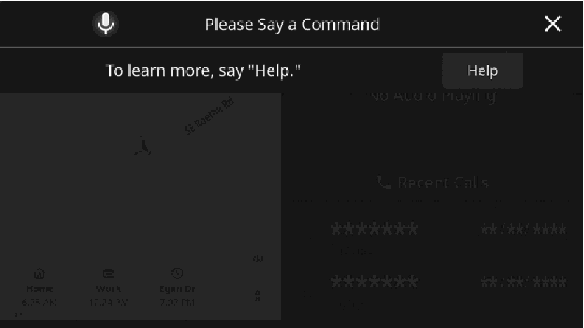
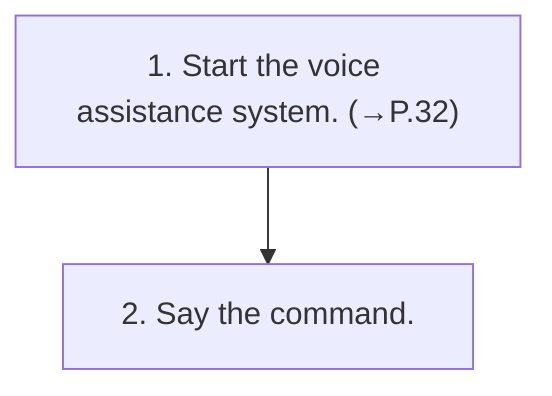

<!-- GENERATED:START function=938ec02b730c (generated; edits inside this block are overwritten by the next publish — write your own notes outside it) -->
# 21. Voice assistance system operation

<b>Function path:</b> Basic operation / Voice assistance system operation <b>Source:</b> printed page 34 <b>Test-ready:</b> yes — no unfilled thresholds and a procedure is present

Every "Presumed requirement" row below is machine-derived from the Owner's Manual text by rule-based extraction — not AI-written — and traceable to the printed page in its Source column.

## Figures (areas of the original PDF; the OM has no figure numbers or captions)

- Figure 21-1 source: p.34
- (Copied from OM) will be displayed.

## Procedure

| Seq | Step | Operation (Copied from OM) | Source |
|---|---|---|---|
| 1 | 1 | Start the voice assistance system. (→P.32) | p.34 / step |
| 2 | 2 | Say the command. | p.34 / step |

## 21-2-2. Service requirements

| # | Presumed requirement | Strength | Source |
|---|---|---|---|
| 1 | Step -The voice assistance top screen will be displayed and a beep will sound. | capability | p.34 / bullet |
| 2 | Step -Touch “Help” or say “Help” to display some of the commands supported by the system by category. If a category name is selected, the selected category command list will be displayed. | constraint | p.34 / bullet |
| 3 | Step -To cancel voice assistance, press and hold the voice assistance switch on the steering wheel, or touch “[icon]”. | capability | p.34 / bullet |
| 4 | Step -Turn the VOLUME knob, or use the +/- switch on the steering wheel to adjust the speech guidance volume. | capability | p.34 / bullet |
<!-- GENERATED:END function=938ec02b730c -->

