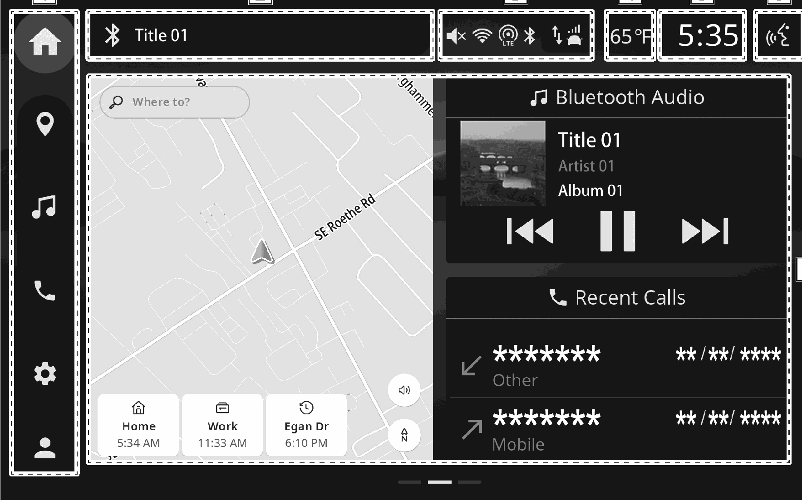

<!-- GENERATED:START function=5550f84cb774 (generated; edits inside this block are overwritten by the next publish — write your own notes outside it) -->
# 3. Center information display overview

<b>Function path:</b> Basic operation / Center information display overview <b>Source:</b> printed page 17, 18 <b>Test-ready:</b> no — procedure missing or thresholds unfilled

Every "Presumed requirement" row below is machine-derived from the Owner's Manual text by rule-based extraction — not AI-written — and traceable to the printed page in its Source column.

## Figures (areas of the original PDF; the OM has no figure numbers or captions)

- Figure 3-1 source: p.17
- (Copied from OM) Main menu

## 3-2-1. Service overview

| # | Presumed requirement | Strength | Source |
|---|---|---|---|
| 1 | Center information display overviewMain menu Select the desired icon to display the corresponding functions screen on the home screen. (→P.19). | capability | p.17 / text |
| 2 | Center information display overviewInformation bar. | capability | p.18 / text |

## 3-2-2. Service requirements

| # | Presumed requirement | Strength | Source |
|---|---|---|---|
| 1 | Step -Displays notification information, such as that of the functions being used. | capability | p.18 / bullet |
| 2 | Step -For some notification information displayed, select to display the operation screen of the selected category. | capability | p.18 / bullet |
| 3 | Center information display overviewStatus icons. | capability | p.18 / text |
| 4 | Step -The status of the Bluetooth connection, etc. is displayed. (→P.20). | capability | p.18 / bullet |
| 5 | Center information display overviewOutside temperature. | capability | p.18 / text |
| 6 | Step -Unit of measurements displayed can be changed. Refer to the vehicle Owner’s Manual for details. | capability | p.18 / bullet |
| 7 | Step -Select to display the clock setting screen. Refer to the vehicle Owner’s Manual for details. | capability | p.18 / bullet |
| 8 | Center information display overviewVoice assistance button. | capability | p.18 / text |
| 9 | Step -Start the voice assistance system. (→P.31). | capability | p.18 / bullet |
| 10 | Center information display overviewHome screen. | capability | p.18 / text |
| 11 | Step -Operate the functions in this display area. (→P.20). | capability | p.18 / bullet |
<!-- GENERATED:END function=5550f84cb774 -->

