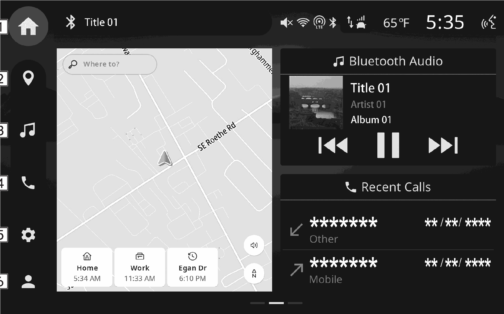

<!-- GENERATED:START function=69f2c9e9c8eb (generated; edits inside this block are overwritten by the next publish — write your own notes outside it) -->
# 4. Main menu

<b>Function path:</b> Basic operation / Main menu <b>Source:</b> printed page 19, 20 <b>Test-ready:</b> no — procedure missing or thresholds unfilled

Every "Presumed requirement" row below is machine-derived from the Owner's Manual text by rule-based extraction — not AI-written — and traceable to the printed page in its Source column.

## Figures (areas of the original PDF; the OM has no figure numbers or captions)

- Figure 4-1 source: p.19
- (Copied from OM) Display the home screen.

## 4-2-1. Service overview

| # | Presumed requirement | Strength | Source |
|---|---|---|---|
| 1 | Main menuDisplay the home screen. | capability | p.19 / text |
| 2 | Main menuDisplay the map screen. (→P.119) *. | capability | p.19 / text |
| 3 | Main menuDisplay the audio control screen. Select the desired audio source. (→P.90). | capability | p.19 / text |
| 4 | Main menuDisplay the phone screen. (→P.74) When Apple CarPlay/Android AutoTM is used, the Apple CarPlay/Android AutoTM icon will be displayed. (→P.67, 70). | constraint | p.19 / text |
| 5 | Main menuDisplay the settings screen. (→P.40). | capability | p.19 / text |
| 6 | Main menu“Driver Profile”: By registering the preferred vehicle conditions and settings of registered drivers in advance, the driver profiles function allows those conditions/settings to be recalled when a registered driver is to drive. Refer to the vehicle Owner’s Manual for details. “Manage Devices”: Display two devices based on the favorites registration and use history conditions. Select the desired device to display its settings screen. (→P.44). | constraint | p.19 / text |
| 7 | Main menu*: If equipped. | constraint | p.20 / text |
<!-- GENERATED:END function=69f2c9e9c8eb -->

