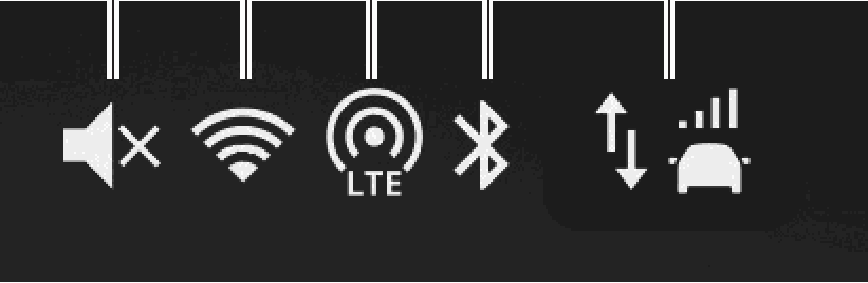

<!-- GENERATED:START function=f39b23aaa768 (generated; edits inside this block are overwritten by the next publish — write your own notes outside it) -->
# 5. Status icons

<b>Function path:</b> Basic operation / Status icons <b>Source:</b> printed page 20 <b>Test-ready:</b> no — procedure missing or thresholds unfilled

Every "Presumed requirement" row below is machine-derived from the Owner's Manual text by rule-based extraction — not AI-written — and traceable to the printed page in its Source column.

## Figures (areas of the original PDF; the OM has no figure numbers or captions)

- Figure 5-1 source: p.20
- (Copied from OM) Poor Excellent

## 5-2-1. Service overview

| # | Presumed requirement | Strength | Source |
|---|---|---|---|
| 1 | Status iconsDisplayed when the audio system volume is mute. (→P.16). | constraint | p.20 / text |
| 2 | Status iconsPoor Excellent *1 Displayed when Wi-Fi® function is on. Displays the level of Wi-Fi® reception. | constraint | p.20 / text |
| 3 | Status iconsPoor Excellent *1*2 Displayed when Wi-Fi® Hotspot function is on. Displays the level of Wi-Fi® Hotspot reception. | constraint | p.20 / text |
| 4 | Status iconsDisplayed when the Bluetooth connection is established. | constraint | p.20 / text |
| 5 | Status iconsDisplayed when DCM (Data Communication Module in vehicle cellular connection) is used. *1 Select to display the privacy policy and terms of use. | constraint | p.20 / text |
| 6 | Status icons*1: If equipped *2: Refer to the Owner’s Manual supplement for “MySubaru Connected Services” for details. | constraint | p.20 / text |
<!-- GENERATED:END function=f39b23aaa768 -->

