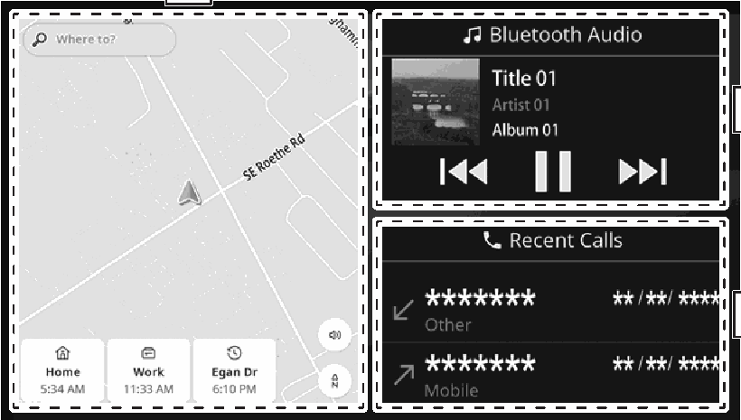
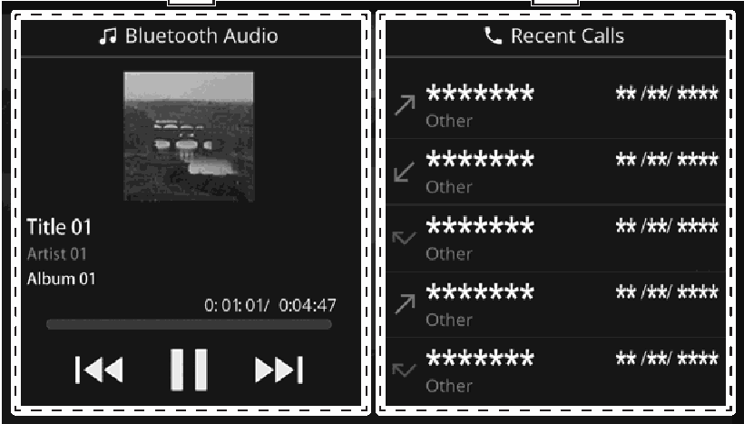

<!-- GENERATED:START function=ffa1806d4d34 (generated; edits inside this block are overwritten by the next publish — write your own notes outside it) -->
# 8. Widget screen

<b>Function path:</b> Basic operation / Widget screen <b>Source:</b> printed page 21 <b>Test-ready:</b> no — procedure missing or thresholds unfilled

Every "Presumed requirement" row below is machine-derived from the Owner's Manual text by rule-based extraction — not AI-written — and traceable to the printed page in its Source column.

## Figures (areas of the original PDF; the OM has no figure numbers or captions)

- Figure 8-1 source: p.21
- (Copied from OM) Models without navigation system

- Figure 8-2 source: p.21
- (Copied from OM) Displays the map screen. Simple operations are available on this screen.

## 8-2-1. Service overview

| # | Presumed requirement | Strength | Source |
|---|---|---|---|
| 1 | Widget screenModels with navigation system. | capability | p.21 / text |
| 2 | Widget screenModels without navigation system. | capability | p.21 / text |
| 3 | Widget screenDisplays the map screen. Simple operations are available on this screen. | capability | p.21 / text |
| 4 | Widget screenDisplays simple operations screen of the selected audio source. Simple operations are available on this screen. Selecting the upper part displays the audio screen. (→P.89). | capability | p.21 / text |
| 5 | Widget screenDisplays recent calls. Select to make a call. Selecting the upper part displays the phone screen. (→P.74). | capability | p.21 / text |
<!-- GENERATED:END function=ffa1806d4d34 -->

