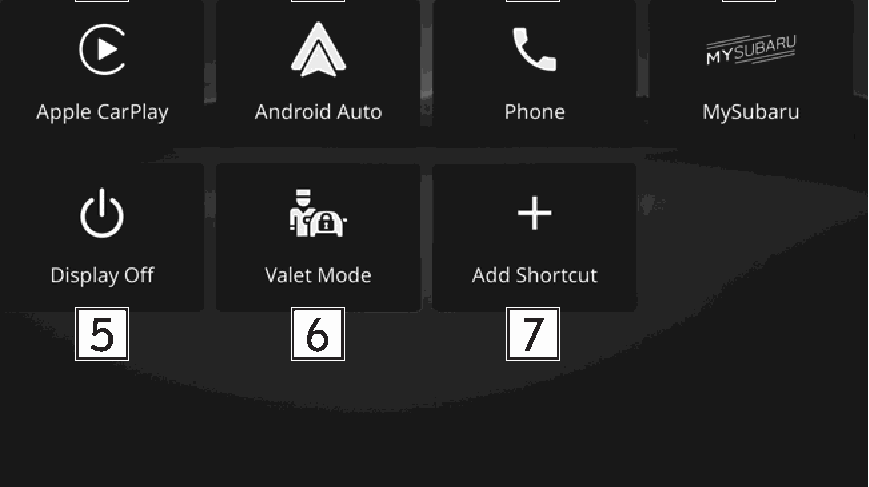
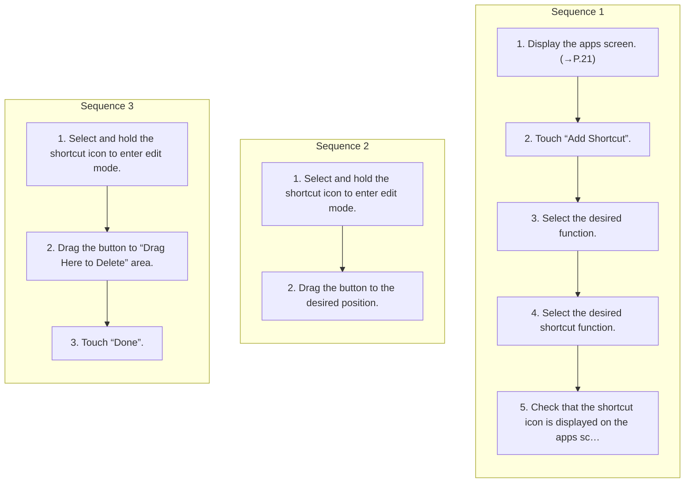

<!-- GENERATED:START function=d0183e16e02e (generated; edits inside this block are overwritten by the next publish — write your own notes outside it) -->
# 9. Apps screen

<b>Function path:</b> Basic operation / Apps screen <b>Source:</b> printed page 22, 23 <b>Test-ready:</b> yes — no unfilled thresholds and a procedure is present

Every "Presumed requirement" row below is machine-derived from the Owner's Manual text by rule-based extraction — not AI-written — and traceable to the printed page in its Source column.

## Figures (areas of the original PDF; the OM has no figure numbers or captions)

- Figure 9-1 source: p.22
- (Copied from OM) Display the Apple CarPlay screen. (→P.67)

## Procedure (3 sequences; the manual restarts the numbering)

| Seq | Step | Operation (Copied from OM) | Source |
|---|---|---|---|
| 1 | 1 | Display the apps screen. (→P.21) | p.22 / step |
| 1 | 2 | Touch “Add Shortcut”. | p.22 / step |
| 1 | 3 | Select the desired function. | p.22 / step |
| 1 | 4 | Select the desired shortcut function. | p.22 / step |
| 1 | 5 | Check that the shortcut icon is displayed on the apps screen. | p.22 / step |
| 2 | 1 | Select and hold the shortcut icon to enter edit mode. | p.23 / step |
| 2 | 2 | Drag the button to the desired position. | p.23 / step |
| 3 | 1 | Select and hold the shortcut icon to enter edit mode. | p.23 / step |
| 3 | 2 | Drag the button to “Drag Here to Delete” area. | p.23 / step |
| 3 | 3 | Touch “Done”. | p.23 / step |

## 9-2-1. Service overview

| # | Presumed requirement | Strength | Source |
|---|---|---|---|
| 1 | Apps screenDisplay the Apple CarPlay screen. (→P.67). | capability | p.22 / text |
| 2 | Apps screenDisplay the Android Auto screen. (→P.70). | capability | p.22 / text |
| 3 | Apps screenDisplay the phone screen. (→P.74). | capability | p.22 / text |
| 4 | Apps screenAccess MySubaru from “MySubaru Connected Services” for a variety of remote services. * Refer to the Owner’s Manual supplement for “MySubaru Connected Services” for details. | capability | p.22 / text |
| 5 | Apps screenTurn the display off. Refer to the vehicle Owner’s Manual for details. | capability | p.22 / text |
| 6 | Apps screenValet mode restricts operations of the system when valet parking is used, to prevent unwanted access to personal information stored in the system. Refer to the vehicle Owner’s Manual for details. | constraint | p.22 / text |
| 7 | Apps screenFrequently used functions and operations can be added to the apps screen. (→P.22) Button positions can be changed freely. (→P.23). | capability | p.22 / text |
| 8 | Apps screen*: If equipped. | constraint | p.22 / text |
| 9 | Apps screenAdding shortcut icons the apps screen. | capability | p.22 / text |

## 9-2-2. Service requirements

| # | Presumed requirement | Strength | Source |
|---|---|---|---|
| 1 | Step -Depending on the function, select other items and enter necessary information. | capability | p.22 / bullet |
| 2 | Step -When shortcuts are added, the apps screen can be expanded to up to 3 pages. The page can be changed by swiping. | capability | p.23 / bullet |
| 3 | Apps screenMoving and deleting shortcut icons. | capability | p.23 / text |
| 4 | Apps screenWhen moving shortcut icons 1. | capability | p.23 / text |
| 5 | Step -User can move buttons to another page by dragging them to the corresponding end of the screen if the number of buttons allows for multiple pages. | constraint | p.23 / bullet |
| 6 | Apps screenWhen deleting shortcut icons. | capability | p.23 / text |
<!-- GENERATED:END function=d0183e16e02e -->

