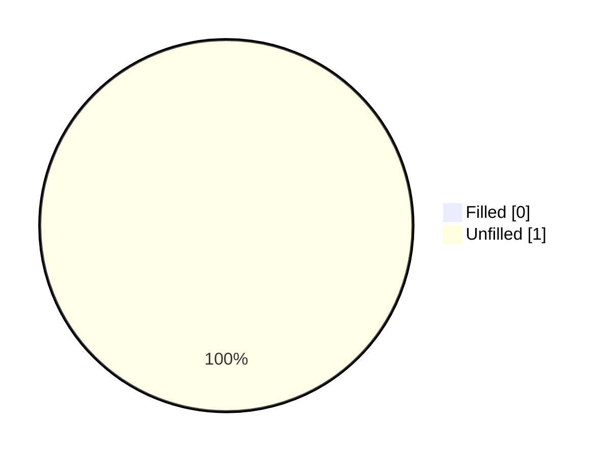
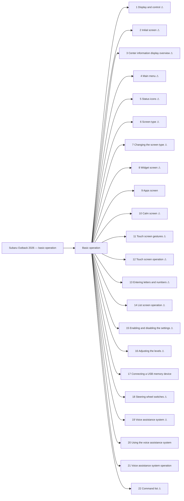

<!-- GENERATED:START index (generated; edits inside this block are overwritten by the next publish — write your own notes outside it) -->
# Subaru Outback 2026 — basic-operation — Presumed specification

> This is a machine-derived estimate, not an official requirements document. Numeric thresholds left blank could not be found in the manual and must be filled in by a tester with evidence.

| Field | Value |
|---|---|
| Maker / Model | Subaru / Outback 2026 |
| Scope | basic-operation |
| Markets | US, CA |
| Profile | subaru_v1 |
| Manual ID | subaru/outback-2026/ivi |

## Numeric thresholds

- Thresholds detected: **1**
- Filled: **0** / unfilled: **1**
- Test-ready functions: **4 / 22**

The manual states almost no numbers, so a tester fills the thresholds in. A function that still has an unfilled threshold cannot become a test specification (`is_test_ready=false`). Fill them in `overlay/thresholds.yaml` or on the screen.

## Figures in the manual

- Figures: **14** / images rendered: **14**

Each image is a rendering of the corresponding area of the original PDF. **Images are not kept in the repository** (they are copies of another company's manual); `publish` creates them under `../figures/` on the machine that runs it.

## Glossary (registered by a reviewer)

How wording in the manual maps to the in-house term. **The original text is not rewritten** — the mapping is only annotated here. Register terms on the Glossary screen. Evidence (why the mapping holds) is required.

| In-house term | Category | Wording in the manual | Hits | Evidence |
|---|---|---|---:|---|
| AA | abbreviation | `Android Auto` | 7 | Counted by string match over workspace/subaru/**/published/*.md (2026-09-01): outback-2026 31 / outback-2025 24 / ascent-2026 1. Always printed in full ("Android Auto") — no abbreviated form appears in the manual text; "AA" is an in-house-only abbreviation. |

## Functions

| No. | Function | Area | Requirements | Figures | Unfilled thresholds | Test-ready |
|---|---|---|---|---|---|---|
| 1 | [Display and control](/specifications/subaru/outback-2026/ivi/file/1-display-and-control.md?chapter=basic-operation) | Basic operation | 7 | 0 | 0 | - |
| 2 | [Initial screen](/specifications/subaru/outback-2026/ivi/file/2-initial-screen.md?chapter=basic-operation) | Basic operation | 2 | 1 | 1 | - |
| 3 | [Center information display overview](/specifications/subaru/outback-2026/ivi/file/3-center-information-display-overview.md?chapter=basic-operation) | Basic operation | 13 | 1 | 0 | - |
| 4 | [Main menu](/specifications/subaru/outback-2026/ivi/file/4-main-menu.md?chapter=basic-operation) | Basic operation | 7 | 1 | 0 | - |
| 5 | [Status icons](/specifications/subaru/outback-2026/ivi/file/5-status-icons.md?chapter=basic-operation) | Basic operation | 6 | 1 | 0 | - |
| 6 | [Screen type](/specifications/subaru/outback-2026/ivi/file/6-screen-type.md?chapter=basic-operation) | Basic operation | 1 | 0 | 0 | - |
| 7 | [Changing the screen type](/specifications/subaru/outback-2026/ivi/file/7-changing-the-screen-type.md?chapter=basic-operation) | Basic operation | 1 | 0 | 0 | - |
| 8 | [Widget screen](/specifications/subaru/outback-2026/ivi/file/8-widget-screen.md?chapter=basic-operation) | Basic operation | 5 | 2 | 0 | - |
| 9 | [Apps screen](/specifications/subaru/outback-2026/ivi/file/9-apps-screen.md?chapter=basic-operation) | Basic operation | 15 | 1 | 0 | o |
| 10 | [Calm screen](/specifications/subaru/outback-2026/ivi/file/10-calm-screen.md?chapter=basic-operation) | Basic operation | 4 | 1 | 0 | - |
| 11 | [Touch screen gestures](/specifications/subaru/outback-2026/ivi/file/11-touch-screen-gestures.md?chapter=basic-operation) | Basic operation | 10 | 0 | 0 | - |
| 12 | [Touch screen operation](/specifications/subaru/outback-2026/ivi/file/12-touch-screen-operation.md?chapter=basic-operation) | Basic operation | 11 | 0 | 0 | - |
| 13 | [Entering letters and numbers](/specifications/subaru/outback-2026/ivi/file/13-entering-letters-and-numbers.md?chapter=basic-operation) | Basic operation | 12 | 1 | 0 | - |
| 14 | [List screen operation](/specifications/subaru/outback-2026/ivi/file/14-list-screen-operation.md?chapter=basic-operation) | Basic operation | 5 | 1 | 0 | - |
| 15 | [Enabling and disabling the settings](/specifications/subaru/outback-2026/ivi/file/15-enabling-and-disabling-the-settings.md?chapter=basic-operation) | Basic operation | 1 | 1 | 0 | - |
| 16 | [Adjusting the levels](/specifications/subaru/outback-2026/ivi/file/16-adjusting-the-levels.md?chapter=basic-operation) | Basic operation | 1 | 1 | 0 | - |
| 17 | [Connecting a USB memory device](/specifications/subaru/outback-2026/ivi/file/17-connecting-a-usb-memory-device.md?chapter=basic-operation) | Basic operation | 5 | 0 | 0 | o |
| 18 | [Steering wheel switches](/specifications/subaru/outback-2026/ivi/file/18-steering-wheel-switches.md?chapter=basic-operation) | Basic operation | 8 | 0 | 0 | - |
| 19 | [Voice assistance system](/specifications/subaru/outback-2026/ivi/file/19-voice-assistance-system.md?chapter=basic-operation) | Basic operation | 4 | 0 | 0 | - |
| 20 | [Using the voice assistance system](/specifications/subaru/outback-2026/ivi/file/20-using-the-voice-assistance-system.md?chapter=basic-operation) | Basic operation | 23 | 1 | 0 | o |
| 21 | [Voice assistance system operation](/specifications/subaru/outback-2026/ivi/file/21-voice-assistance-system-operation.md?chapter=basic-operation) | Basic operation | 4 | 1 | 0 | o |
| 22 | [Command list](/specifications/subaru/outback-2026/ivi/file/22-command-list.md?chapter=basic-operation) | Basic operation | 22 | 0 | 0 | - |
<!-- GENERATED:END index -->

