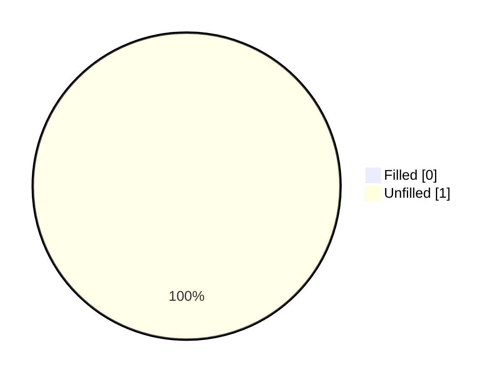
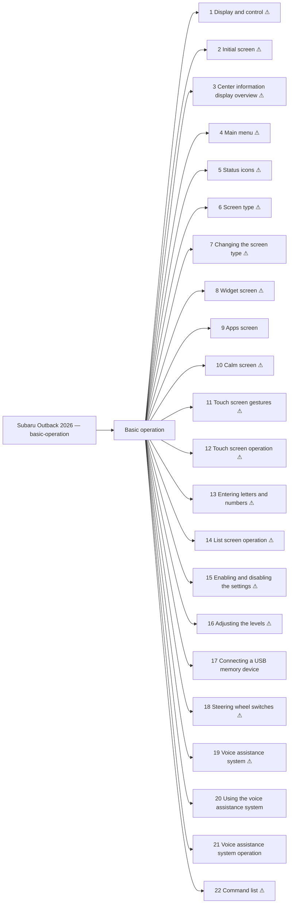

<!-- GENERATED:START index (generated; edits inside this block are overwritten by the next publish — write your own notes outside it) -->
# Subaru Outback 2026 — basic-operation — Presumed specification

> This is a machine-derived estimate, not an official requirements document. Numeric thresholds left blank could not be found in the manual and must be filled in by a tester with evidence.

| Field | Value |
|---|---|
| Maker / Model | Subaru / Outback 2026 |
| Scope | basic-operation |
| Markets | US, CA |
| Profile | subaru_v1 |
| Manual ID | subaru/outback-2026/ivi |

## Numeric thresholds
Filled: 0 / Unfilled: 1

## Figures in the manual
14 figure area(s) detected.

## Functions

| No. | Function | Area | Requirements | Figures | Unfilled thresholds | Test-ready |
|---|---|---|---|---|---|---|
| 1 | Display and control | Basic operation | 7 | 0 | 0 | - |
| 2 | Initial screen | Basic operation | 2 | 1 | 1 | - |
| 3 | Center information display overview | Basic operation | 13 | 1 | 0 | - |
| 4 | Main menu | Basic operation | 7 | 1 | 0 | - |
| 5 | Status icons | Basic operation | 6 | 1 | 0 | - |
| 6 | Screen type | Basic operation | 1 | 0 | 0 | - |
| 7 | Changing the screen type | Basic operation | 1 | 0 | 0 | - |
| 8 | Widget screen | Basic operation | 5 | 2 | 0 | - |
| 9 | Apps screen | Basic operation | 15 | 1 | 0 | o |
| 10 | Calm screen | Basic operation | 4 | 1 | 0 | - |
| 11 | Touch screen gestures | Basic operation | 10 | 0 | 0 | - |
| 12 | Touch screen operation | Basic operation | 11 | 0 | 0 | - |
| 13 | Entering letters and numbers | Basic operation | 12 | 1 | 0 | - |
| 14 | List screen operation | Basic operation | 5 | 1 | 0 | - |
| 15 | Enabling and disabling the settings | Basic operation | 1 | 1 | 0 | - |
| 16 | Adjusting the levels | Basic operation | 1 | 1 | 0 | - |
| 17 | Connecting a USB memory device | Basic operation | 5 | 0 | 0 | o |
| 18 | Steering wheel switches | Basic operation | 8 | 0 | 0 | - |
| 19 | Voice assistance system | Basic operation | 4 | 0 | 0 | - |
| 20 | Using the voice assistance system | Basic operation | 23 | 1 | 0 | o |
| 21 | Voice assistance system operation | Basic operation | 4 | 1 | 0 | o |
| 22 | Command list | Basic operation | 22 | 0 | 0 | - |
<!-- GENERATED:END index -->

