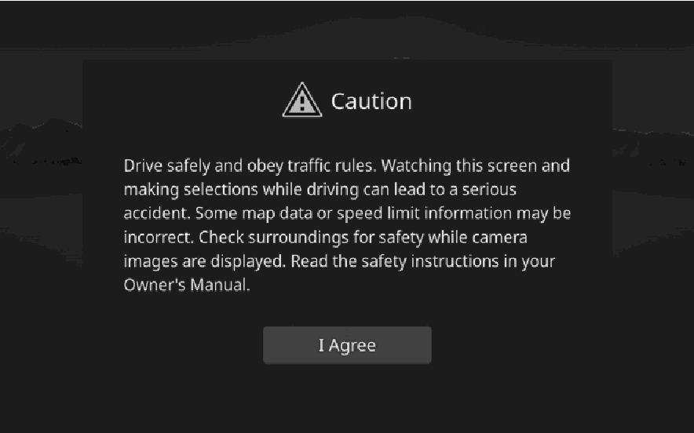

<!-- GENERATED:START function=9fca8af24e52 (generated; edits inside this block are overwritten by the next publish — write your own notes outside it) -->
# 6. Safety instruction

<b>Function path:</b> Introduction / Safety instruction <b>Source:</b> printed page 10, 11 <b>Test-ready:</b> no — procedure missing or thresholds unfilled

Every "Presumed requirement" row below is machine-derived from the Owner's Manual text by rule-based extraction — not AI-written — and traceable to the printed page in its Source column.

## Figures (areas of the original PDF; the OM has no figure numbers or captions)

- Figure 6-1 source: p.10
- (Copied from OM) To use this system in the safest possible manner, follow all the safety tips shown

## Numeric thresholds (filled in by a tester)
Filled: 0 / unfilled: 1

| Threshold | Matching text (Copied from OM) | Kind | Unit | Value | Status | Evidence | Filled by |
|---|---|---|---|---|---|---|---|
| 496e32f7fc14 | occasionally | frequency | — | **unfilled** | unfilled | — | — |

## 6-2-1. Service overview

| # | Presumed requirement | Strength | Source |
|---|---|---|---|
| 1 | Safety instructionTo use this system in the safest possible manner, follow all the safety tips shown below. | capability | p.10 / text |
| 2 | Safety instructionThis system is intended to assist in reaching the destination and, if used properly, can do so. The driver is solely responsible for the safe operation of your vehicle and the safety of your passengers. | constraint | p.10 / text |
| 3 | Safety instructionDo not use any feature of this system to the extent it becomes a distraction and prevents safe driving. The first priority while driving should always be the safe operation of the vehicle. While driving, be sure to observe all traffic regulations. | capability | p.10 / text |
| 4 | Safety instructionPrior to the actual use of this system, learn how to use it and become thoroughly familiar with it. Read the entire manual to make sure you understand the system. Do not allow other people to use this system until they have read and understood the instructions in this manual. | capability | p.10 / text |
| 5 | Safety instructionFor your safety, some functions may become inoperable when driving. Unavailable screen buttons are dimmed. Only when the vehicle is not moving, can the destination and route selection be done. | constraint | p.10 / text |

## 6-2-2. Service requirements

| # | Presumed requirement | Strength | Source |
|---|---|---|---|
| 1 | Step -For safety, the driver should not operate the system while he/she is driving. Insufficient attention to the road and traffic may cause an accident. | capability | p.11 / bullet |
| 2 | Safety instructionThe data in the system may occasionally be incomplete. Road conditions, including driving restrictions (no left turns, street closures, etc.) frequently change. Therefore, before following any instructions from the system, look to see whether the instruction can be done safely and legally. | capability | p.11 / text |
| 3 | Safety instructionUse this system only in locations where it is legal to do so. Some states/provinces may have laws prohibiting the use of video and navigation screens next to the driver. | capability | p.11 / text |

## 6-5. Exception operation

| # | Presumed requirement | Strength | Source |
|---|---|---|---|
| 1 | Step -While driving, be sure to obey the traffic regulations and maintain awareness of the road conditions. If a traffic sign on the road has been changed, route guidance may not have the updated information such as the direction of a one way street. | constraint | p.11 / bullet |
| 2 | Safety instructionWhile driving, listen to the voice instructions as much as possible and glance at the screen briefly and only when it is safe. However, do not totally rely on voice guidance. Use it just for reference. If the system cannot determine the current position correctly, there is a possibility of incorrect, late, or non-voice guidance. | constraint | p.11 / text |
| 3 | Safety instructionThis system cannot warn about such things as the safety of an area, condition of streets, and availability of emergency services. If unsure about the safety of an area, do not drive into it. Under no circumstances is this system a substitute for the driver’s personal judgement. | constraint | p.11 / text |
<!-- GENERATED:END function=9fca8af24e52 -->

