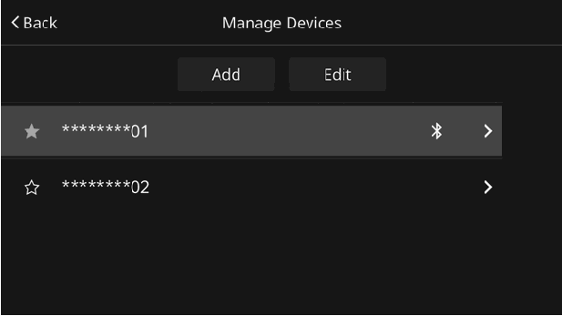

<!-- GENERATED:START function=930596c459f4 (generated; edits inside this block are overwritten by the next publish — write your own notes outside it) -->
# 7. How to read this manual

<b>Function path:</b> Introduction / How to read this manual <b>Source:</b> printed page 12 <b>Test-ready:</b> no — procedure missing or thresholds unfilled

Every "Presumed requirement" row below is machine-derived from the Owner's Manual text by rule-based extraction — not AI-written — and traceable to the printed page in its Source column.

## Figures (areas of the original PDF; the OM has no figure numbers or captions)

- Figure 7-1 source: p.12
- (Copied from OM) No. Name Description

## 7-2-1. Service overview

| # | Presumed requirement | Strength | Source |
|---|---|---|---|
| 1 | How to read this manualNo. Name Description Operational outlines An outline of the operation is explained. Main operations The steps of an operation are explained. Describes supplemental information relating to main Supplemental information operation. | capability | p.12 / text |

## 7-2-2. Service requirements

| # | Presumed requirement | Strength | Source |
|---|---|---|---|
| 1 | Step -In this manual, screen buttons and displays are described as “○○○”. In Owner’s Manuals of some languages, they are described as “○○○ (○○ ○)”. Displays after languages are changed in the settings screen are described as “(○○○)”. | capability | p.12 / bullet |
<!-- GENERATED:END function=930596c459f4 -->

