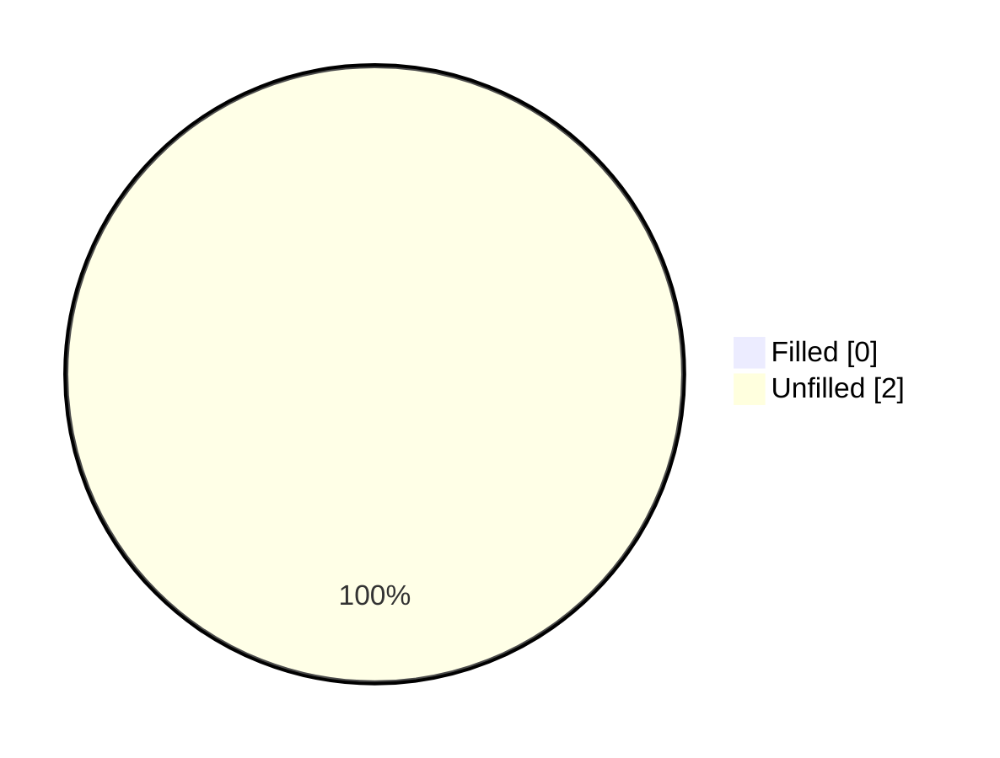
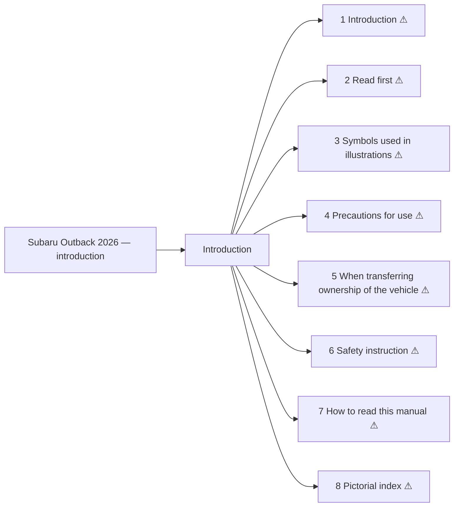

<!-- GENERATED:START index (generated; edits inside this block are overwritten by the next publish — write your own notes outside it) -->
# Subaru Outback 2026 — introduction — Presumed specification

> This is a machine-derived estimate, not an official requirements document. Numeric thresholds left blank could not be found in the manual and must be filled in by a tester with evidence.

| Field | Value |
|---|---|
| Maker / Model | Subaru / Outback 2026 |
| Scope | introduction |
| Markets | — |
| Profile | subaru_v1 |
| Manual ID | subaru/outback-2026/multimedia |

## Numeric thresholds
Filled: 0 / Unfilled: 2

## Figures in the manual
2 figure area(s) detected.

## Functions

| No. | Function | Area | Requirements | Figures | Unfilled thresholds | Test-ready |
|---|---|---|---|---|---|---|
| 1 | Introduction | Introduction | 3 | 0 | 0 | - |
| 2 | Read first | Introduction | 8 | 0 | 0 | - |
| 3 | Symbols used in illustrations | Introduction | 4 | 0 | 0 | - |
| 4 | Precautions for use | Introduction | 45 | 0 | 1 | - |
| 5 | When transferring ownership of the vehicle | Introduction | 1 | 0 | 0 | - |
| 6 | Safety instruction | Introduction | 11 | 1 | 1 | - |
| 7 | How to read this manual | Introduction | 2 | 1 | 0 | - |
| 8 | Pictorial index | Introduction | 4 | 0 | 0 | - |
<!-- GENERATED:END index -->

