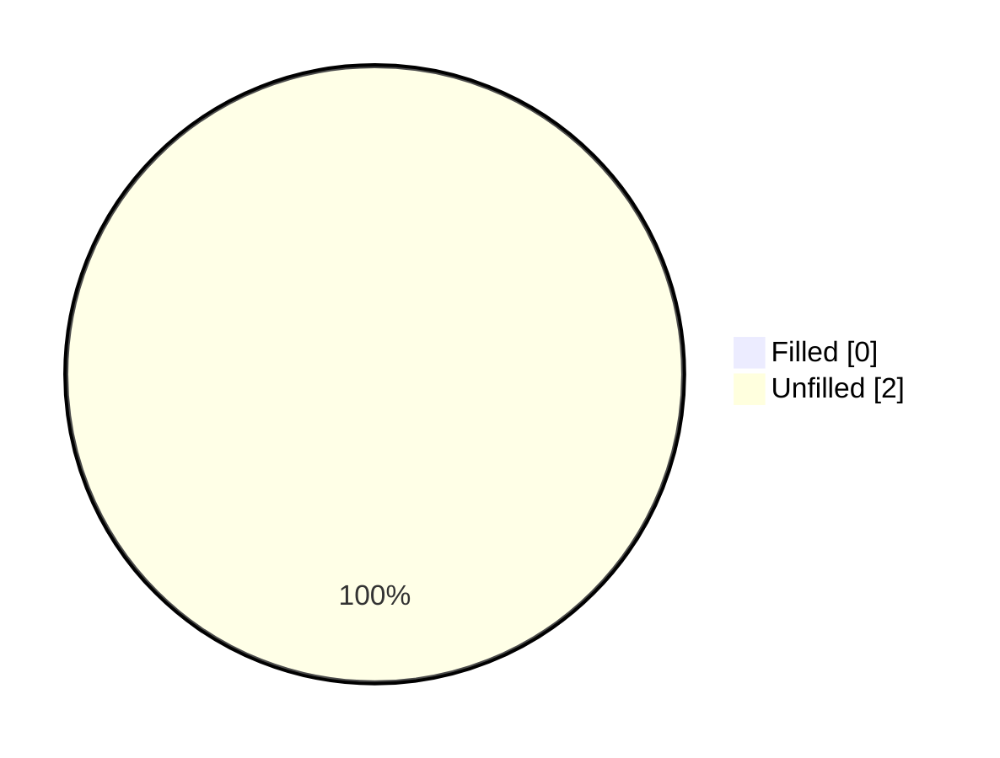
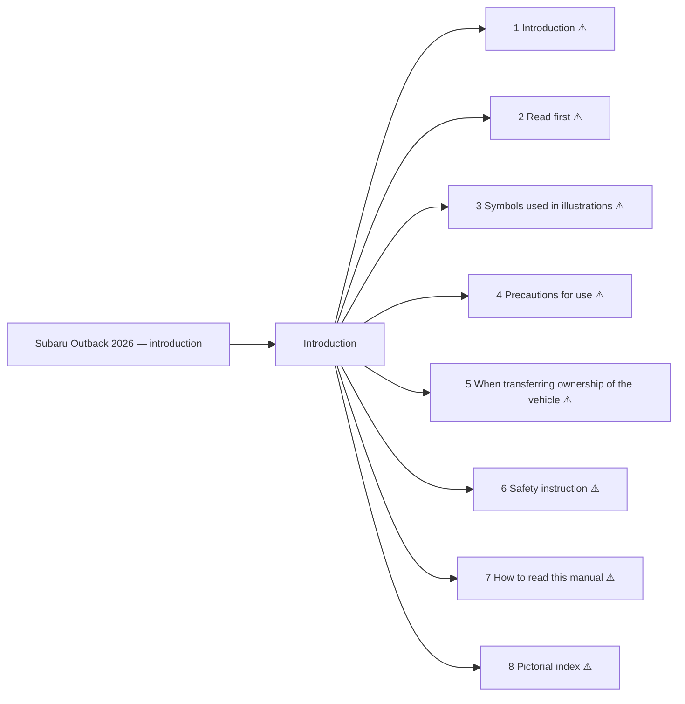

<!-- GENERATED:START index (generated; edits inside this block are overwritten by the next publish — write your own notes outside it) -->
# Subaru Outback 2026 — introduction — Presumed specification

> This is a machine-derived estimate, not an official requirements document. Numeric thresholds left blank could not be found in the manual and must be filled in by a tester with evidence.

| Field | Value |
|---|---|
| Maker / Model | Subaru / Outback 2026 |
| Scope | introduction |
| Markets | US, CA |
| Profile | subaru_v1 |
| Manual ID | subaru/outback-2026/ivi |

## Numeric thresholds

- Thresholds detected: **2**
- Filled: **0** / unfilled: **2**
- Test-ready functions: **0 / 8**

The manual states almost no numbers, so a tester fills the thresholds in. A function that still has an unfilled threshold cannot become a test specification (`is_test_ready=false`). Fill them in `overlay/thresholds.yaml` or on the screen.

## Figures in the manual

- Figures: **2** / images rendered: **2**

Each image is a rendering of the corresponding area of the original PDF. **Images are not kept in the repository** (they are copies of another company's manual); `publish` creates them under `../figures/` on the machine that runs it.

## Functions

| No. | Function | Area | Requirements | Figures | Unfilled thresholds | Test-ready |
|---|---|---|---|---|---|---|
| 1 | [Introduction](/specifications/subaru/outback-2026/ivi/file/1-introduction.md?chapter=introduction) | Introduction | 3 | 0 | 0 | - |
| 2 | [Read first](/specifications/subaru/outback-2026/ivi/file/2-read-first.md?chapter=introduction) | Introduction | 8 | 0 | 0 | - |
| 3 | [Symbols used in illustrations](/specifications/subaru/outback-2026/ivi/file/3-symbols-used-in-illustrations.md?chapter=introduction) | Introduction | 4 | 0 | 0 | - |
| 4 | [Precautions for use](/specifications/subaru/outback-2026/ivi/file/4-precautions-for-use.md?chapter=introduction) | Introduction | 45 | 0 | 1 | - |
| 5 | [When transferring ownership of the vehicle](/specifications/subaru/outback-2026/ivi/file/5-when-transferring-ownership-of-the-vehicle.md?chapter=introduction) | Introduction | 1 | 0 | 0 | - |
| 6 | [Safety instruction](/specifications/subaru/outback-2026/ivi/file/6-safety-instruction.md?chapter=introduction) | Introduction | 11 | 1 | 1 | - |
| 7 | [How to read this manual](/specifications/subaru/outback-2026/ivi/file/7-how-to-read-this-manual.md?chapter=introduction) | Introduction | 2 | 1 | 0 | - |
| 8 | [Pictorial index](/specifications/subaru/outback-2026/ivi/file/8-pictorial-index.md?chapter=introduction) | Introduction | 4 | 0 | 0 | - |
<!-- GENERATED:END index -->

