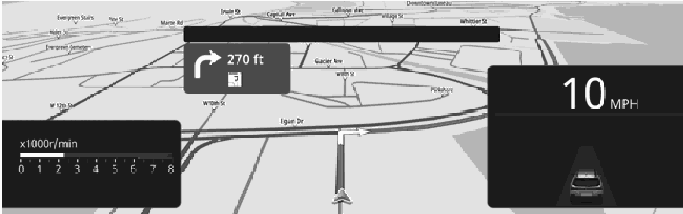

<!-- GENERATED:START function=bfa15bd028bd (generated; edits inside this block are overwritten by the next publish — write your own notes outside it) -->
# 10. Displayed on the instrument cluster display

<b>Function path:</b> Navigation (if equipped) / Displayed on the instrument cluster display <b>Source:</b> printed page 124 <b>Test-ready:</b> no — procedure missing or thresholds unfilled

Every "Presumed requirement" row below is machine-derived from the Owner's Manual text by rule-based extraction — not AI-written — and traceable to the printed page in its Source column.

## Figures (areas of the original PDF; the OM has no figure numbers or captions)

- Figure 10-1 source: p.125
- (Copied from OM) Navigation menu

## 10-2-1. Service overview

| # | Presumed requirement | Strength | Source |
|---|---|---|---|
| 1 | Displayed on the instrument cluster displayThe instrument cluster’s basic screen will display some of the navigation system display that is displayed on the center information display. | capability | p.124 / text |
| 2 | Displayed on the instrument cluster displayWhen map mode is selected for the instrument cluster display, map and the navigation system display are displayed. Refer to the vehicle Owner’s Manual for how to select map mode. | capability | p.124 / text |
<!-- GENERATED:END function=bfa15bd028bd -->

