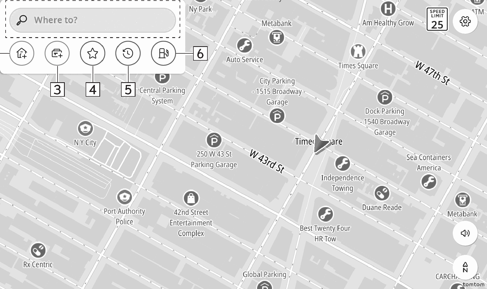

<!-- GENERATED:START function=d3e5e86188c6 (generated; edits inside this block are overwritten by the next publish — write your own notes outside it) -->
# 11. Navigation menu screen

<b>Function path:</b> Navigation (if equipped) / Navigation menu screen <b>Source:</b> printed page 125, 126 <b>Test-ready:</b> no — procedure missing or thresholds unfilled

Every "Presumed requirement" row below is machine-derived from the Owner's Manual text by rule-based extraction — not AI-written — and traceable to the printed page in its Source column.

## Figures (areas of the original PDF; the OM has no figure numbers or captions)

- Figure 11-1 source: p.125
- (Copied from OM) Select to display the search screen. (→P.126)

## 11-2-1. Service overview

| # | Presumed requirement | Strength | Source |
|---|---|---|---|
| 1 | Navigation menu screenThe navigation menu is always displayed on the map screen. | capability | p.125 / text |
| 2 | Navigation menu screenSelect to display the search screen. (→P.126). | capability | p.125 / text |

## 11-2-2. Service requirements

| # | Presumed requirement | Strength | Source |
|---|---|---|---|
| 1 | Step -“[icon]”: Select to register a point as home. (→P.130). | capability | p.126 / bullet |
| 2 | Step -“[icon]”: Select to set the point registered as home as the destination. (→P.127). | capability | p.126 / bullet |
| 3 | Step -“[icon]”: Select to register a point as work. (→P.130). | capability | p.126 / bullet |
| 4 | Step -“[icon]”: Select to set the point registered as work as the destination. (→P.127). | capability | p.126 / bullet |
| 5 | Navigation menu screenSelect to display a list of points registered to the favorites. (→P.128). | capability | p.126 / text |
| 6 | Navigation menu screenSelect to display a list of recently set destinations. (→P.130). | capability | p.126 / text |
| 7 | Navigation menu screenSelect to display a list of gas stations. | capability | p.126 / text |
<!-- GENERATED:END function=d3e5e86188c6 -->

