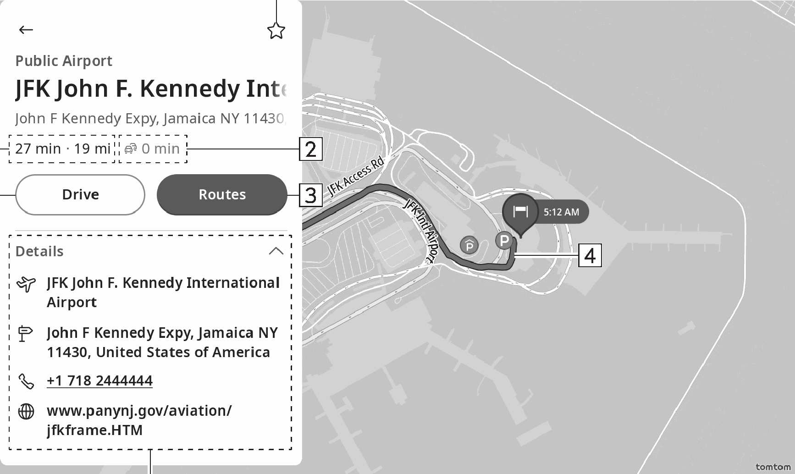

<!-- GENERATED:START function=26a0bbe8768f (generated; edits inside this block are overwritten by the next publish — write your own notes outside it) -->
# 13. Destination information screen

<b>Function path:</b> Navigation (if equipped) / Destination information screen <b>Source:</b> printed page 127, 128 <b>Test-ready:</b> no — procedure missing or thresholds unfilled

Every "Presumed requirement" row below is machine-derived from the Owner's Manual text by rule-based extraction — not AI-written — and traceable to the printed page in its Source column.

## Figures (areas of the original PDF; the OM has no figure numbers or captions)

- Figure 13-1 source: p.127
- (Copied from OM) and touch “Search here”. Then a new search will be performed.

## 13-2-1. Service overview

| # | Presumed requirement | Strength | Source |
|---|---|---|---|
| 1 | Destination information screenObtains online and displays various information related to the destination. | capability | p.127 / text |
| 2 | Destination information screenSelect to register the destination to the favorites. Select a second time to cancel the registration. | capability | p.128 / text |
| 3 | Destination information screenDisplays time to be increased/decreased by taking the most recent traffic information into account. | capability | p.128 / text |
| 4 | Destination information screenSelect to display the route calculation screen. (→P.131). | capability | p.128 / text |
| 5 | Destination information screenRoute to the destination. | capability | p.128 / text |
| 6 | Destination information screenDisplays details of the destination, such as address, phone number, business hours, website URL, etc. | capability | p.128 / text |

## 13-2-2. Service requirements

| # | Presumed requirement | Strength | Source |
|---|---|---|---|
| 1 | Step -Select the phone number to make a phone call. | capability | p.128 / bullet |
| 2 | Destination information screenSelect to start route guidance. (→P.133). | capability | p.128 / text |
| 3 | Destination information screenDisplays expected time and distance to the destination. | capability | p.128 / text |
<!-- GENERATED:END function=26a0bbe8768f -->

