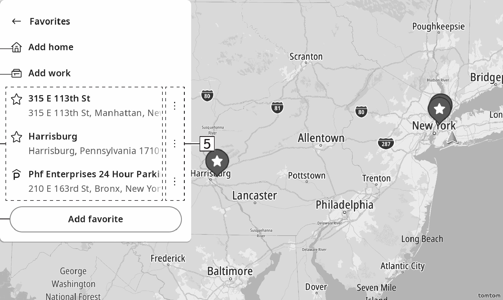

<!-- GENERATED:START function=aaf603dc37d1 (generated; edits inside this block are overwritten by the next publish — write your own notes outside it) -->
# 14. Favorites screen

<b>Function path:</b> Navigation (if equipped) / Favorites screen <b>Source:</b> printed page 128, 129 <b>Test-ready:</b> no — procedure missing or thresholds unfilled

Every "Presumed requirement" row below is machine-derived from the Owner's Manual text by rule-based extraction — not AI-written — and traceable to the printed page in its Source column.

## Figures (areas of the original PDF; the OM has no figure numbers or captions)

- Figure 14-1 source: p.129
- (Copied from OM) ●“Add home”: Select to register a point as home. (→P.130)

## 14-2-1. Service overview

| # | Presumed requirement | Strength | Source |
|---|---|---|---|
| 1 | Favorites screenThe desired point can be registered as home, work, or favorite. | capability | p.128 / text |
| 2 | Favorites screenThe registered points can be set as a destination. | capability | p.128 / text |
| 3 | Favorites screenRegistered points can be added, changed and deleted on the favorites screen. | capability | p.128 / text |

## 14-2-2. Service requirements

| # | Presumed requirement | Strength | Source |
|---|---|---|---|
| 1 | Step -“Add home”: Select to register a point as home. (→P.130). | capability | p.129 / bullet |
| 2 | Step -“Home”: Select to set the point registered as home as the destination. (→P.127). | capability | p.129 / bullet |
| 3 | Step -“Add work”: Select to register a point as work. (→P.130). | capability | p.129 / bullet |
| 4 | Step -“Work”: Select to set the point registered as work as the destination. (→P.127) 6. | capability | p.129 / bullet |
| 5 | Favorites screenRegistered points Select to display the destination information screen. (→P.127). | capability | p.129 / text |
| 6 | Favorites screenSelect to register a point as favorite. (→P.130). | capability | p.129 / text |
| 7 | Favorites screenSelect to edit points registered to the favorites. | capability | p.129 / text |
| 8 | Step -“[icon]”: Select to delete registered point(s). | capability | p.129 / bullet |
| 9 | Step -“[icon]”: Select to change names of the registered point(s). | capability | p.129 / bullet |
<!-- GENERATED:END function=aaf603dc37d1 -->

