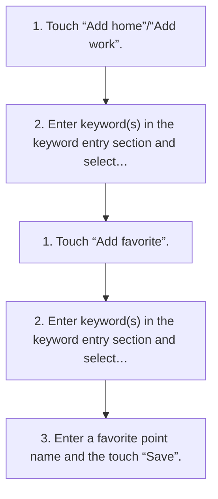

<!-- GENERATED:START function=47abf9f059c4 (generated; edits inside this block are overwritten by the next publish — write your own notes outside it) -->
# 15. Registering home/work/favorite point

<b>Function path:</b> Navigation (if equipped) / Registering home/work/favorite point <b>Source:</b> printed page 130 <b>Test-ready:</b> yes — no unfilled thresholds and a procedure is present

Every "Presumed requirement" row below is machine-derived from the Owner's Manual text by rule-based extraction — not AI-written — and traceable to the printed page in its Source column.

## Procedure

| Seq | Step | Operation (Copied from OM) | Source |
|---|---|---|---|
| 1 | 1 | Touch “Add home”/“Add work”. | p.130 / step |
| 2 | 2 | Enter keyword(s) in the keyword entry section and select the desired point from the candidates list to register it. | p.130 / step |
| 3 | 1 | Touch “Add favorite”. | p.130 / step |
| 4 | 2 | Enter keyword(s) in the keyword entry section and select the desired point from the candidates list. | p.130 / step |
| 5 | 3 | Enter a favorite point name and the touch “Save”. | p.130 / step |

## 15-2-1. Service overview

| # | Presumed requirement | Strength | Source |
|---|---|---|---|
| 1 | Registering home/work/favorite pointRegistering home/work. | capability | p.130 / text |
| 2 | Registering home/work/favorite pointRegistering a favorite point. | capability | p.130 / text |

## 15-2-2. Service requirements

| # | Presumed requirement | Strength | Source |
|---|---|---|---|
| 1 | Step -A point to be registered as favorite can also be selected from the recents screen. (→P.130). | capability | p.130 / bullet |
<!-- GENERATED:END function=47abf9f059c4 -->

