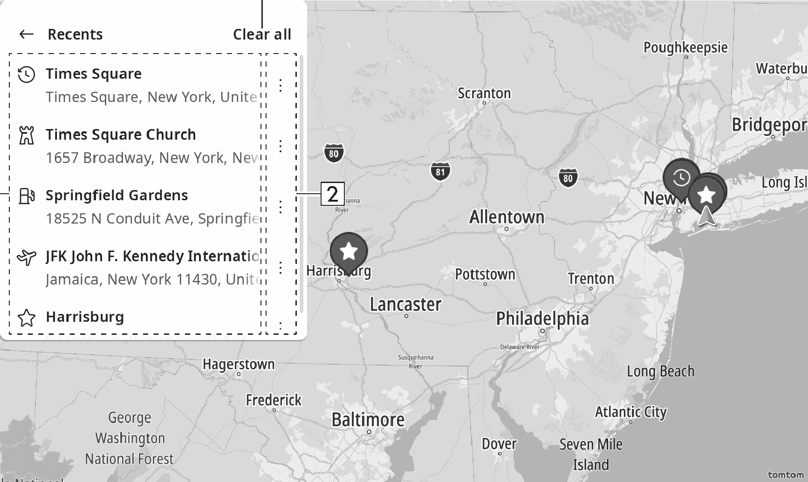

<!-- GENERATED:START function=32fd032a21f2 (generated; edits inside this block are overwritten by the next publish — write your own notes outside it) -->
# 16. Recents screen

<b>Function path:</b> Navigation (if equipped) / Recents screen <b>Source:</b> printed page 130, 131 <b>Test-ready:</b> no — procedure missing or thresholds unfilled

Every "Presumed requirement" row below is machine-derived from the Owner's Manual text by rule-based extraction — not AI-written — and traceable to the printed page in its Source column.

## Figures (areas of the original PDF; the OM has no figure numbers or captions)

- Figure 16-1 source: p.131
- (Copied from OM) List of past destinations

## 16-2-1. Service overview

| # | Presumed requirement | Strength | Source |
|---|---|---|---|
| 1 | Recents screenDisplays a list of recent destinations. | capability | p.130 / text |
| 2 | Recents screenList of past destinations Select to display the destination information screen. (→P.127). | capability | p.131 / text |
| 3 | Recents screenSelect to edit the list of past destinations. | capability | p.131 / text |

## 16-2-2. Service requirements

| # | Presumed requirement | Strength | Source |
|---|---|---|---|
| 1 | Step -“[icon]”: Select to delete the past destination(s). 6. | capability | p.131 / bullet |
| 2 | Step -“[icon]”: Select to register the past destination(s) to the favorites screen. | capability | p.131 / bullet |
| 3 | Recents screenSelect to delete all destinations history. | capability | p.131 / text |
<!-- GENERATED:END function=32fd032a21f2 -->

