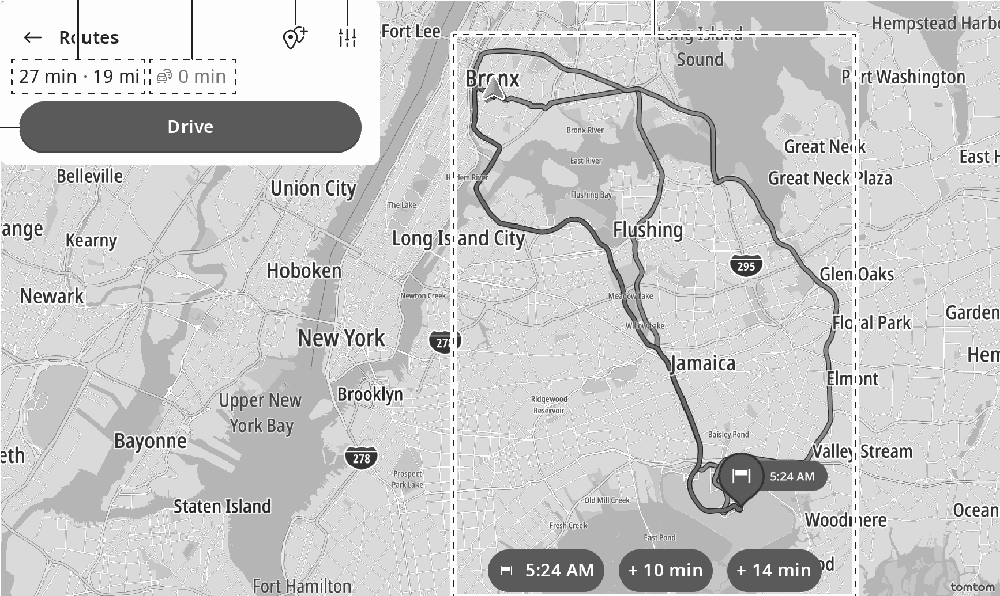

<!-- GENERATED:START function=1071d0d7f877 (generated; edits inside this block are overwritten by the next publish — write your own notes outside it) -->
# 17. Route calculation screen

<b>Function path:</b> Navigation (if equipped) / Route calculation screen <b>Source:</b> printed page 131, 132 <b>Test-ready:</b> no — procedure missing or thresholds unfilled

Every "Presumed requirement" row below is machine-derived from the Owner's Manual text by rule-based extraction — not AI-written — and traceable to the printed page in its Source column.

## Figures (areas of the original PDF; the OM has no figure numbers or captions)

- Figure 17-1 source: p.132
- (Copied from OM) Candidate routes (max. 3 routes)

## 17-2-1. Service overview

| # | Presumed requirement | Strength | Source |
|---|---|---|---|
| 1 | Route calculation screenOn the route calculation screen, searched routes can be viewed. Routes can be changed before route guidance begins by changing the calculation conditions. | capability | p.131 / text |
| 2 | Route calculation screenCandidate routes (max. 3 routes). | capability | p.132 / text |

## 17-2-2. Service requirements

| # | Presumed requirement | Strength | Source |
|---|---|---|---|
| 1 | Step -“Current route type”: Select to select a route calculation condition. | capability | p.132 / bullet |
| 2 | Step -“Avoid on this route”: Select to select road(s) etc. to be avoided. | capability | p.132 / bullet |
| 3 | Route calculation screenDisplays a list of points up to the destination. | capability | p.132 / text |
| 4 | Step -“ ”: Drag upward/downward to change the sequence of destination/waypoint(s). | capability | p.132 / bullet |
| 5 | Step -“ ”: Select to delete unwanted point(s). | capability | p.132 / bullet |
| 6 | Step -“Add stop”: Select to add a waypoint. (→P.126) Search for the desired waypoint on the search screen and then touch “Add stop”. To set the searched point as the destination, touch “Set as destination”. | capability | p.132 / bullet |
| 7 | Route calculation screenDisplays time to be increased/decreased by taking the most recent traffic information into account. | capability | p.132 / text |
| 8 | Route calculation screenDisplays expected time and distance to the destination. | capability | p.132 / text |
| 9 | Route calculation screenSelect to start route guidance. (→P.133). | capability | p.132 / text |
<!-- GENERATED:END function=1071d0d7f877 -->

